# Andyur Architecture

Andyur is a control and governance plane for **untrusted AI-agent execution**.
It decides whether a run may exist, what authority that run receives, and what
runtime constraints apply. Durable orchestration and physical compute are
pluggable execution concerns; they do not own Andyur's authority model.

The core architectural rule is:

> **Andyur decides whether a governed execution may exist and what it means.  
> The orchestration layer decides when admitted work progresses.  
> The run-execution layer turns one admitted run into one exact execution
> generation.  
> The compute/runtime layer materializes and contains that generation.**

---

## 1. Canonical logical architecture

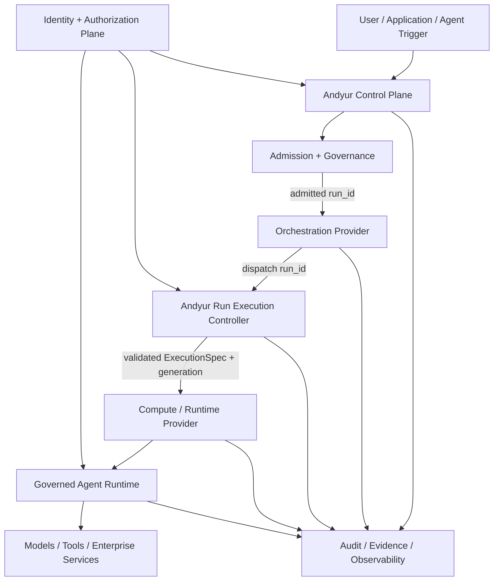

### Ownership by layer

| Layer | Owns | Does not own |
|---|---|---|
| Andyur Control Plane | agents, workflows, runs, policy, registry binding, delegation, approvals, audit truth | physical worker placement |
| Admission / Governance | whether work may run, provider binding, one-live-run rules, scope/pin/user, runtime seal | durable retry mechanics |
| Orchestration Provider | durable progression, retries, timers, signals, schedules where supported | authority, runtime definition, containment |
| Run Execution Controller | revalidation, execution generation, launch-or-adopt semantics, completion ordering, containment intent | provider-specific scheduling or cloud placement |
| Compute / Runtime Provider | materialize, inspect, adopt, terminate, reconcile the physical workload | admission, user authority, tool/model policy |
| Agent Runtime | actual agent code and trusted sidecar/proxy components | platform governance |
| Identity / Authorization Plane | workload identity, delegated authorization, short-lived credentials | durable workflow scheduling |

---

## 2. Current production realization

The current production deployment uses:

- **Temporal** as the durable orchestration provider.
- **Andyur's run-execution controller** as the provider-neutral execution
  boundary.
- **Kubernetes** as the physical compute/runtime backend.
- **SPIFFE/SPIRE** for workload identity.
- Andyur-controlled proxy/sidecar components for model/tool mediation,
  authorization and egress policy.

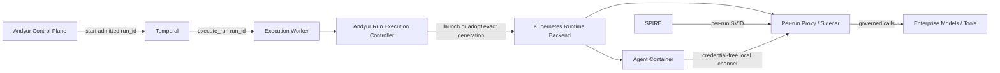

Temporal carries the **run identifier**, not a reusable authority bundle.
The execution worker runs Andyur code, but the actual agent compute begins only
when the runtime backend materializes the governed workload.

The package remains usable without Temporal. The provider binding is explicit
and durable; work already admitted under one provider is not silently moved to
another provider because configuration changed.

---

## 3. Run identity and execution identity

Andyur deliberately separates business identity, orchestration identity and
physical execution identity.

| Identifier | Owner | Purpose |
|---|---|---|
| `workflow_id` | Andyur | governance/business workflow across related runs |
| `run_id` | Andyur | one admitted unit of agent work |
| `execution_generation` | Andyur | one permitted physical incarnation of a run |
| provider execution reference | orchestration provider | opaque durable-execution reference |
| runtime reference | compute provider | opaque physical workload reference |
| per-run SPIFFE ID / SVID | identity plane | cryptographic workload identity for that run |

The central invariant is:

> **One live Andyur run has at most one active logical execution generation.**

A provider retry must therefore reuse the existing generation and adopt the
existing runtime rather than creating another one.

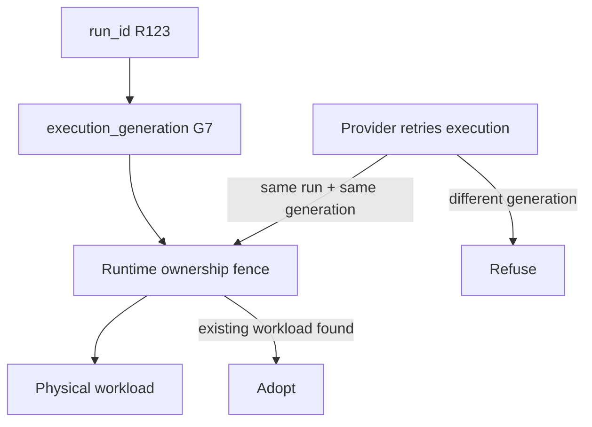

---

## 4. Admission and governance

An agent manifest or caller may request capabilities. A request is never a
grant.

Andyur admission resolves and seals the effective run:

- agent identity;
- authenticated subject / acting user;
- workflow membership and delegation depth;
- granted scope;
- subject/resource pin;
- approved registry artifact;
- runtime resolution;
- model/tool ceilings;
- orchestration provider;
- compute/runtime provider;
- runtime lifetime and resource policy.

The admitted run is stored before the orchestration provider is asked to make
progress.

The orchestration provider cannot mint a valid Andyur run merely by inventing
a `run_id`.

---

## 5. Orchestration provider boundary

The orchestration provider answers **when durable work progresses**.

Conceptually it provides semantics such as:

- health;
- idempotent start;
- durable retry/recovery;
- signals/messages;
- durable timers and waits;
- schedules, if the provider can satisfy Andyur's schedule semantics;
- provider execution status;
- halt of durable progress.

The provider must not become authoritative for:

- acting user;
- scope;
- subject pin;
- registry resolution;
- execution generation;
- workload identity;
- compute specification;
- final audit truth;
- physical containment.

### Current provider implementations

| Provider | Role |
|---|---|
| Temporal | production durable orchestration and dispatch |
| Local | lightweight/local orchestration path |

Additional providers may be introduced only if they preserve Andyur's
provider-neutral semantics.

---

## 6. Andyur Run Execution Controller

The Run Execution Controller is the security and correctness seam between
durable orchestration and physical compute.

For an incoming `run_id`, it:

1. fetches authoritative Andyur state;
2. verifies the run exists and is still live;
3. verifies the workflow is not halted;
4. verifies the run is bound to the calling orchestration path;
5. revalidates the registry/runtime seal;
6. obtains or reuses the run's execution generation;
7. resolves the selected compute/runtime backend;
8. builds the governed runtime specification;
9. launches or adopts the physical runtime;
10. monitors execution;
11. records terminal outcome;
12. releases runtime ownership only after the outcome is durably acknowledged;
13. invokes containment when Andyur condemns the run.

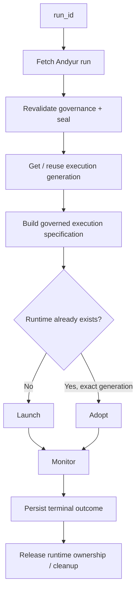

### Completion-before-cleanup invariant

A physical workload may finish before Andyur successfully records its outcome.

Andyur therefore keeps the ownership/adoption fence until completion is
durably acknowledged.

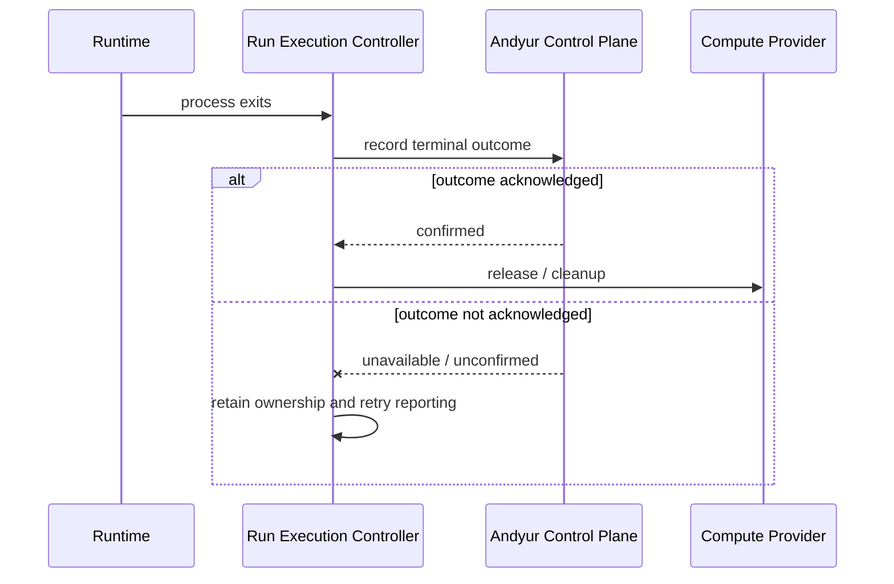

This ordering prevents a retry from seeing a pending run with no execution
fence and launching it a second time.

---

## 7. Compute / runtime provider boundary

The compute/runtime backend answers **how and where an approved execution is
materialized**.

A provider may be Kubernetes, Docker, private-cloud infrastructure, a future
managed compute service, or another runtime capable of satisfying Andyur's
contract.

Core semantics are:

- launch one exact run generation;
- adopt an existing matching generation after controller loss;
- inspect runtime state;
- terminate the exact generation;
- reconcile runtimes that outlive the process that created them;
- preserve required isolation, identity and resource guarantees.

### Physical execution state

A compute provider may provision asynchronously.

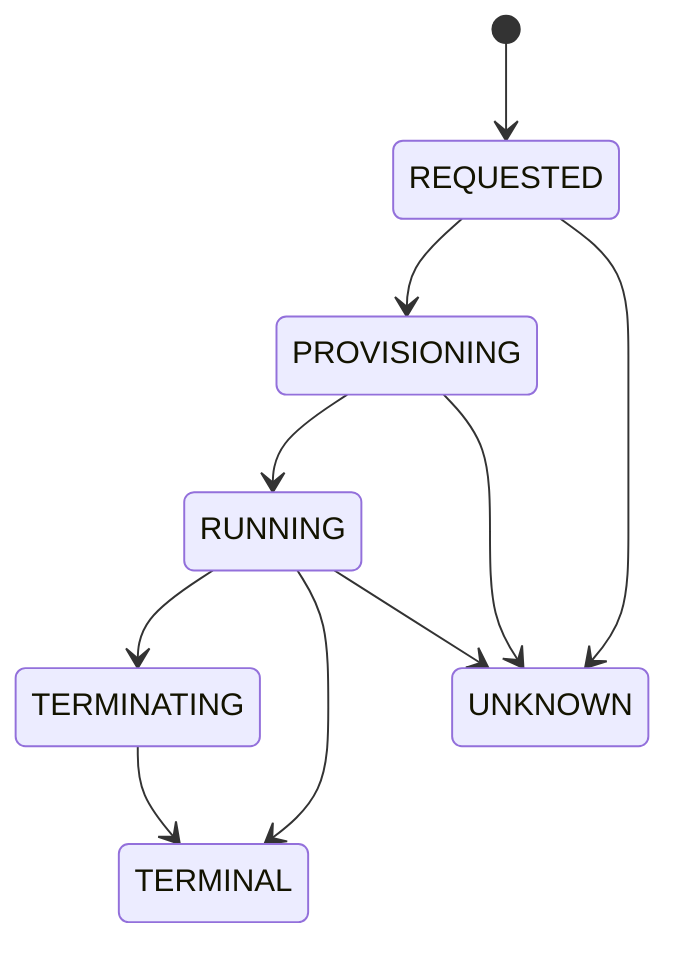

A failed status query is **UNKNOWN**, not proof that the runtime is absent.

### Current runtime backends

- governed Kubernetes;
- Docker/local runtime modes where supported.

The existing Kubernetes implementation uses an exact run-generation ownership
fence so a retry can adopt rather than duplicate.

---

## 8. Governed runtime composition

The agent itself is treated as untrusted.

A governed run separates the untrusted agent from trusted runtime mediation.

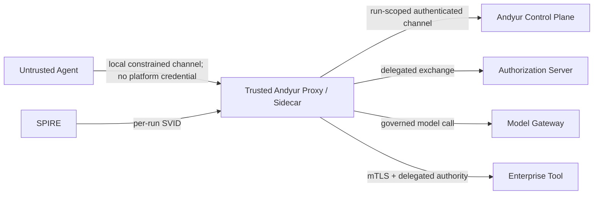

The untrusted agent does not receive the platform worker identity or the
execution worker's SVID.

The per-run trusted workload receives its own independently attested identity.

How a stock third-party agent is run under this composition without changing
it, and how such an agent is certified, are decided in
[ADR-011: the exec/v1 stock-process contract](docs/adr-011-exec-v1-stock-process-contract.md)
and [ADR-012: OSS agent certification](docs/adr-012-oss-agent-certification.md).

---

## 9. Identity model

Andyur uses separate identities for separate principals.

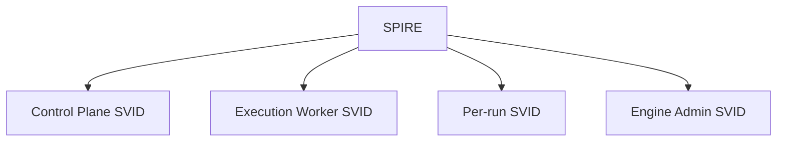

Examples in the current deployment include:

- control-plane identity;
- dedicated execution-worker identity;
- workflow-engine administration identity;
- per-run workload identity.

Different replicas of one infrastructure role may share the same logical
SPIFFE ID while holding separately issued short-lived SVIDs.

The per-run identity is never inherited from the worker that launched it.

---

## 10. Authorization and delegation

A governed request has multiple independent dimensions:

- **actor** — who the run acts for;
- **scope** — what actions are permitted;
- **subject/resource pin** — what the work is about;
- **audience/tool ceiling** — which resources may receive delegated authority;
- **runtime identity** — which attested execution is making the request.

Authority is narrowed at every delegation hop and re-read from current Andyur
state when it is used.

Signals from an orchestration provider are notifications, not authorization
evidence. For example, an approval signal may wake durable work, but the
authoritative approval remains the Andyur `action_request` record.

---

## 11. Halt and containment

Durable cancellation and physical containment are deliberately separate.

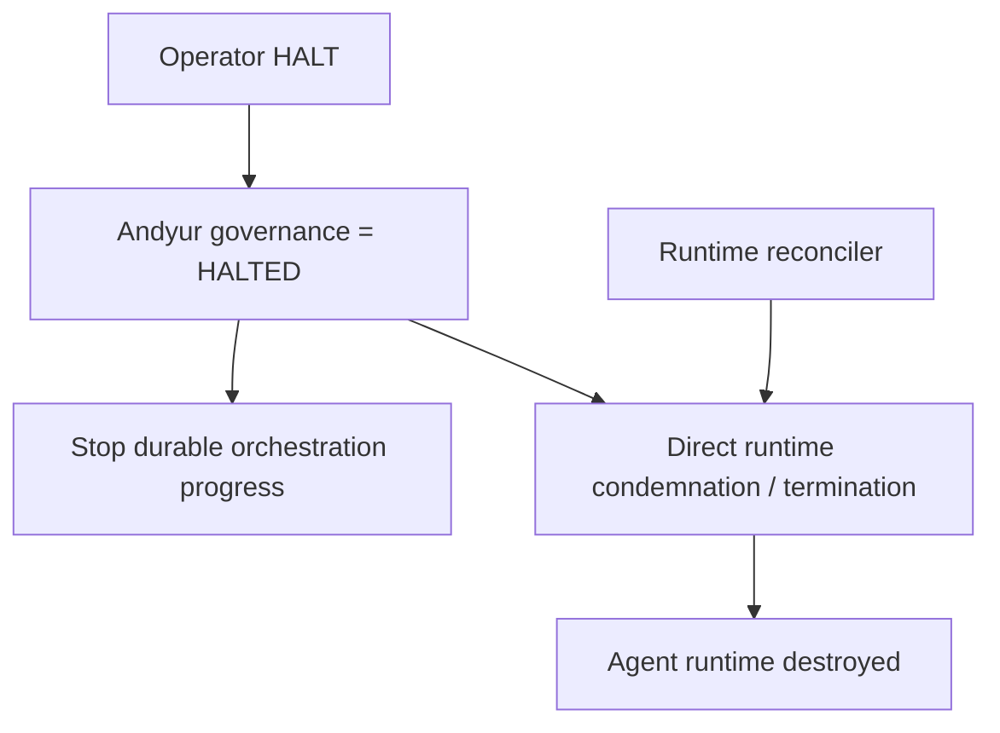

A successful orchestration-provider halt is not proof that the workload has
stopped.

Hard containment must remain possible even when the durable orchestration
engine is unavailable.

This requirement is functional, not vendor-specific: even if one vendor
supplies both orchestration and compute, Andyur requires a containment control
path that does not depend on successful workflow progression.

---

## 12. Failure and recovery model

### Orchestration worker dies before launch

The durable provider retries the execution elsewhere. The same admitted run and
generation are used.

### Execution worker dies after launch

The runtime remains protected by its exact-generation fence. The retry adopts
the existing runtime.

### Orchestration provider is unavailable

New provider-backed durable work may be refused or delayed according to
provider health. Existing runtime containment remains available independently.

### Compute provider is temporarily unreachable

Runtime state becomes UNKNOWN. Andyur must not infer that the workload is gone.

### Andyur control plane is temporarily unreachable

The execution layer does not widen authority or invent state. Existing runtime
security limits, lifetime bounds and reconciliation mechanisms continue to
bound execution until authoritative state is available again.

---

## 13. Schedules, deferred work and approvals

### Schedules

A schedule firing is an admission attempt, not a pre-authorized run.

Andyur's schedule semantics are:

- due tick attempts admission;
- a busy agent does not accumulate a backlog;
- eligible work may retry soon inside a bounded window;
- one logical schedule firing produces at most one admitted run.

### Deferred work

Tasks/messages remain Andyur business records. When eligible, they re-enter the
same admission path and are dispatched through the provider bound to the new
run.

### Approvals

The durable orchestration layer may wait indefinitely and receive a wake-up
signal. The final decision is re-read from Andyur and revalidated against
current authority.

---

## 14. Data ownership

Andyur's database is the authoritative product/governance record.

It stores:

- agents;
- workflows;
- runs;
- provider bindings;
- execution generation;
- schedules;
- tasks/messages;
- approvals;
- registry/runtime provenance;
- audit outcomes.

The orchestration provider stores its own execution mechanics:

- durable history;
- timers;
- retries;
- queue state;
- provider execution references.

The compute provider stores/owns its physical runtime state.

Provider state is never allowed to overwrite Andyur's governance truth merely
because the provider believes something different.

---

## 15. Observability and evidence

One run should be traceable across:

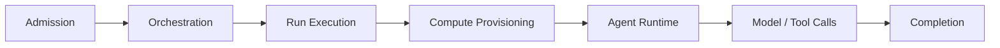

Stable correlation includes:

- Andyur workflow ID;
- Andyur run ID;
- orchestration provider;
- provider execution reference;
- execution generation;
- compute/runtime reference;
- distributed trace context.

Security-relevant evidence is bound to the source that produced it and must be
current for a release claim.

---

## 16. Provider portability

Andyur's semantics are intentionally independent of one orchestration or compute
implementation.

Valid deployment shapes include:

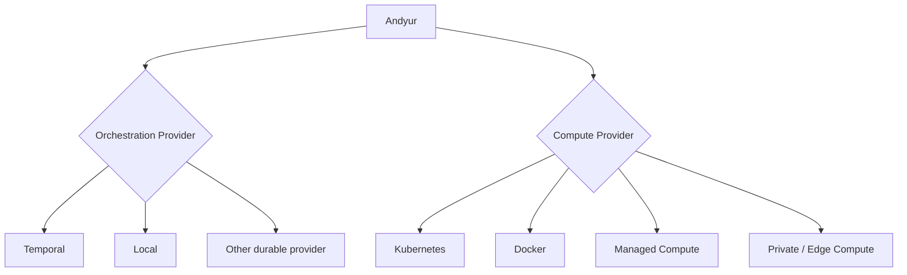

Examples:

| Orchestration | Compute | Use |
|---|---|---|
| Temporal | Kubernetes | current production reference |
| Local | Docker/Kubernetes | development/lightweight deployment |
| another durable provider | Kubernetes | provider-portability target |
| Temporal | managed compute | future deployment if the compute provider satisfies Andyur's contract |

Adding an orchestration provider should not require rewriting admission,
identity, containment or runtime security.

Adding a compute provider should not require rewriting durable workflow,
delegation or authorization semantics.

---

## 17. Security invariants

The architecture depends on these invariants:

1. A manifest/request is never itself a grant.
2. Andyur admits work before an orchestration provider can execute it.
3. A provider cannot mint a valid Andyur run by inventing an ID.
4. One agent has at most one live run under the configured governance rule.
5. One run has at most one active execution generation.
6. A retry adopts the same generation; it does not create a duplicate runtime.
7. Physical runtime identity is independent of worker identity.
8. The untrusted agent never receives infrastructure SVIDs or platform secrets.
9. Authority is fetched/revalidated from current Andyur state, not replayed from
   durable provider history.
10. A provider signal is not authorization evidence.
11. Runtime absence is proved, not inferred from a failed query.
12. Terminal outcome is durably acknowledged before execution ownership is
   released.
13. Hard containment does not depend on successful orchestration progress.
14. Existing live work does not silently change orchestration or compute
   provider when configuration changes.
15. Provider-specific SDK types and vocabulary stay behind provider adapters.

---

## 18. Final mental model

The whole platform can be summarized as:

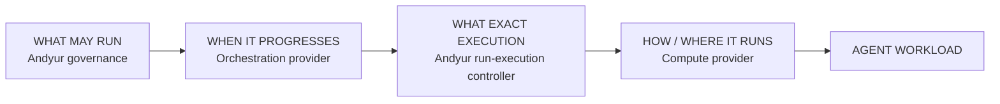

**Andyur owns trust and execution semantics.  
The orchestration provider owns durability.  
The compute provider owns physical materialization.  
The agent remains an untrusted workload inside those controls.**
