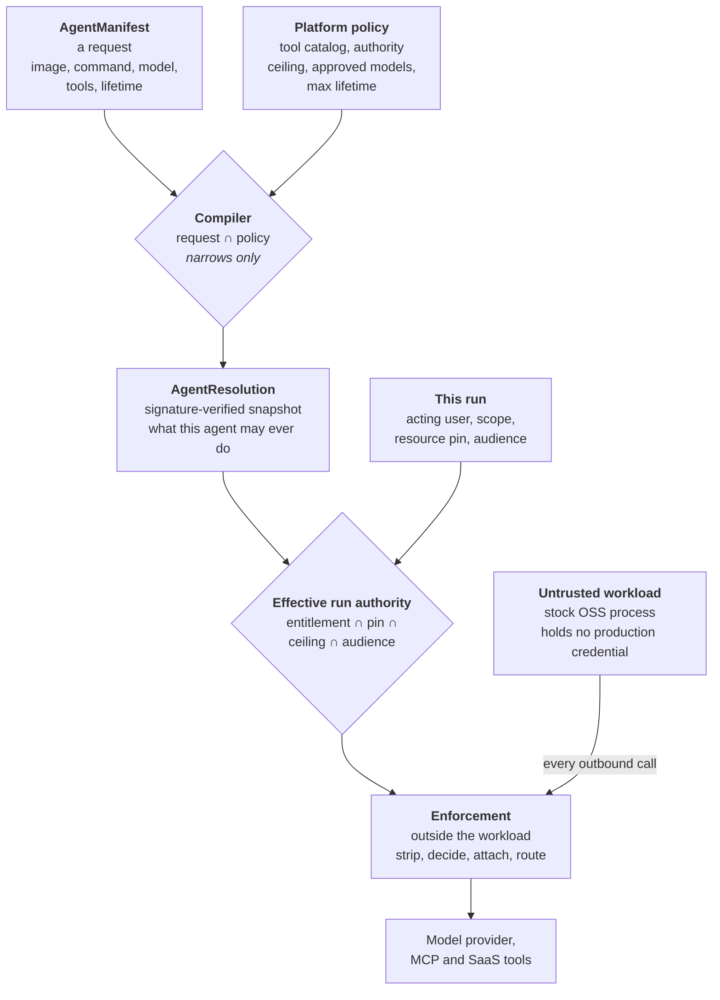

# Andyur in three concepts

Andyur takes an untrusted workload, computes exactly what this one invocation is
allowed to do, and enforces that outside the workload.

Everything else in this repository is an implementation of those three steps.
There are three concepts a reader needs, and only three.

| Concept | The question it answers | Where it lives |
| --- | --- | --- |
| **AgentManifest** | what the developer is asking for | `andyur/agentspec/parser.py` |
| **AgentResolution** | what this agent may **ever** do | `andyur/registry/models.py` |
| **Effective run authority** | what **this invocation** may do | `andyur/server/registry.py` |



## 1. AgentManifest is a request, never a grant

A developer declares what they want: an image and command, a model, the MCP tools
they intend to call, and a lifetime. Nothing in that document grants anything.

`compile_resolution` (`compile_resolution` in `andyur/agentspec/compiler.py`) intersects the request
with platform policy (`PlatformPolicy`, `PlatformPolicy` in `andyur/agentspec/models.py`). The
intersection can only narrow. An over-long lifetime is clamped to the policy
ceiling; a tool outside the catalog is dropped; a request the policy cannot grant
is refused outright with `ManifestDenied`.

## 2. AgentResolution is the agent's ceiling

The compiler's output is one immutable, signature-verified snapshot
(`AgentResolution` in `andyur/registry/models.py`) holding both halves of an
agent's identity: what it may do, and what it may run.

Two things commonly mistaken for concepts are fields inside it.
`RuntimeResolution` (`RuntimeResolution`, same file) is the executable identity, the image digest and
command. `ToolBinding` is one approved tool with its per-tool grants. Neither is
a peer of the three; both are parts of this one.

This snapshot is the widest the agent will ever be. It is not what any particular
run gets.

## 3. Effective run authority is what this invocation may do

One run is narrower than its agent, because a run also has an acting user, a
scope, and a resource pin.

```
authority = entitlement AND pin AND ceiling AND audience
```

That is `narrow()` (`narrow()` in `andyur/server/registry.py`), and it is the only
implementation of the intersection. It has five call sites.

Four reach it through `authority_for()`, which reads the agent's
ceiling from the registry itself and gives the caller no say in it, so "the
caller supplied a wider ceiling" is not a request that can be expressed: token
exchange (`andyur/server/tokenexchange.py`, twice), the per-run tool
decision (`andyur/server/app.py`), and the data plane's ext_authz
(`andyur/dataplane/extauthz.py`).

The fifth is the one `registry.narrow(` call in `andyur/server/coordinator.py`, which runs directly
at run creation to seal the result into the run row. It reads the ceiling with
the same registry helper `authority_for()` uses, so it supplies no ceiling of
its own. `narrow()` is deliberately public and does take a `ceiling` argument;
the module's own rule, in `andyur/server/registry.py`'s docstring, is that a mint path uses
`authority_for()` instead.

**It is not a stored object.** The run row seals the immutable inputs
(`acting_user`, `scope`, `subject_context`, `registry_digest`,
`ceiling_audiences`, `runtime_resolution` in `andyur/db.py`) and the authority is
derived from them. Do not add a fourth concept to name the result.

## The three refusals

The product is a set of refusals. If you only remember one drawing, remember
where they happen.

| The workload tries | What happens | Where |
| --- | --- | --- |
| to ask for more than policy allows | the compiler **narrows or refuses** | `compile_resolution` |
| to set its own credential header | the sidecar **strips it** and attaches the approved one | `sidecar.strip_inbound` |
| to call an MCP tool it was not granted | the call is **denied** and `tools/list` **shortens** | `permitted_tools` |

The third is one function, deliberately. `permitted_tools` backs both the
`tools/call` denial and the `tools/list` rewrite, so the menu an agent sees and
the calls it may make cannot drift apart.

## Who decides, and who enforces

The control plane decides. Enforcement points enforce.

The per-tool decision is made on the server (grep `THE PER-TOOL DECISION IS
MADE HERE` in `andyur/server/app.py`) and the
sidecar receives the result. The sidecar computes no authority of its own; it
strips inbound credentials, enforces the decision it was handed, attaches the
approved credential, and routes. There may be many enforcement points. There is
one semantic decision.

## What is built, and what is not

The runtime supports stock `exec/v1` invocations. The compiler carries validated
`process` and `configuration` into `RuntimeResolution`; the daemon/controller
executes the plan through the generic model and tool fronts. Goose, OpenSRE and
Hermes Agent are manifest examples, not workload-specific platform adapters. Committed live
evidence must match the executed source before it certifies a current checkout.

One deliberately unsupported capability remains:

- **A resident or "service" agent.** The runtime serves one invocation per run
  and never restarts a pod, so `mode: service` is refused at both gates
  (`andyur/agentspec/parser.py` and `_grant_lifecycle` in `andyur/agentspec/compiler.py`). There is deliberately
  no policy flag to enable it: a switch that promises a capability the runtime
  does not have is a promise nothing keeps.

## Reading order

Read this page first. Then `ARCHITECTURE.md` for what is built in detail, and
`docs/network-topology.md` for the trust topology: which component may open a
connection to which, over what, and where it is enforced. That document is
deliberately an edge table rather than one blended diagram, because a review in
August 2026 found a single picture could be mis-translated into over-permissive
policy.

Some documents in `docs/` are **plans**, not descriptions, and say so in their own
opening. `docs/authority-architecture.md` is marked "DECIDED, NOT BUILT" and
records the reasoning behind the AS/PDP/PEP split.
`docs/authority-flow-by-step.md` marks steps 3 to 6 "not specified", meaning the
requirement has not been written rather than that current behaviour is correct.
`docs/decisions.md` is the settled-decisions fence: read it before touching
identity, authority or tokens.

## Keeping this page true

Every claim above names a file. This page is wrong if any of these stop holding,
and each is one command to check:

Citations here name SYMBOLS, not line numbers, on purpose: a line number in a
document is a claim that rots the next time somebody else edits the file, and it
rots silently.

- `narrow()` is the only implementation of the intersection, and every call site
  either goes through `authority_for()` or reads the agent's real ceiling the way
  `authority_for()` does. A caller that passes a ceiling of its own breaks the
  central claim of section 3.
- `permitted_tools` is defined exactly once. Two copies break the one property it
  exists to keep.
- `mode: service` is refused at both gates.
- The compiler preserves `process` and `configuration` in `RuntimeResolution`;
  live evidence is tied to the code that actually executed, not just local files.
