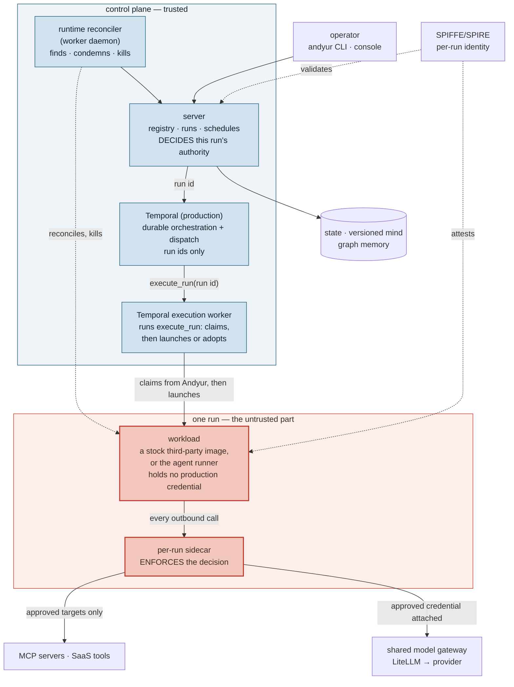

# Andyur

A minimal, self-hostable platform for running AI agents you do not fully trust.

Andyur computes exactly what one run is allowed to do, then enforces that
outside the workload. The agent holds no production credential, reaches the
network through one governed egress, and is offered a tool menu no wider than
its grant. Inside that boundary the agents are long-lived: they wake on
schedules and messages, do real work with tools, and remember what happened
across runs.

The workload itself can be a stock third-party container image. It needs no
Andyur SDK and no Andyur awareness.

**New here, start with [`CONCEPTS.md`](CONCEPTS.md)** -- the whole system in
three concepts and one page.

Built on plain open components: Python, FastAPI, SQLite or Postgres, S3-style
object storage (MinIO) for the versioned agent mind, the Claude Agent SDK,
Neo4j for graph memory, and OpenTelemetry for tracing. SPIFFE/SPIRE for
workload identity, Envoy in front of the per-run authorization broker on the
Kubernetes path, and OpenBao for credential custody compose in on the governed
paths, each opt-in so the getting-started path needs none of them.

## Architecture



**The one thing to take from this:** the decision and the enforcement are in
different places, and neither is inside the workload. The server computes what a
run may do; the per-run sidecar carries that out on every call leaving the
workload. An agent that is fully prompt-injected still cannot widen its own
grant, read a credential it was never given, or reach a target nobody approved --
because none of those live where the agent runs. The red boxes are the part
assumed to be compromised.

Principles:

- The server owns all state; every other process talks HTTP.
- An agent's "mind" (profile, knowledge, instructions, memory) lives in object
  storage behind the server; changes to its self and learnings are versioned and rollbackable.
- Coordination is a database constraint, not a state machine: a partial unique
  index admits at most one live run per agent, so claiming an agent IS inserting
  its run and concurrent triggers cannot double-run it. Agent status is a VIEW
  over runs, so it cannot drift from them.
- Runs are cheap, isolated subprocesses; the platform survives any of them
  dying.
- The control plane decides what a run may do; enforcement points outside the
  workload carry that decision out. There may be many enforcement points and
  exactly one place the decision is made.
- A manifest is a request, never a grant. Policy narrows it and can only narrow.

## Status

Working:

- control plane server: agent registry, coordination, run records, self-healing
- agent runner on the Claude Agent SDK: five phases, sectioned prompt, memory
- versioned agent mind in object storage (local or S3/MinIO), with history and rollback
- production dispatch: Temporal dispatches each admitted run to an execution worker, which launches or adopts it through Andyur's runtime layer; a runtime reconciler contains runs with the engine gone
- Local provider (the package default): a worker daemon with a heartbeat, slot pool and runner subprocesses
- multi-agent collaboration: cron scheduling, tasks (delegation), messaging + chat
- pluggable LLM backend: Anthropic API, Claude subscription, or local Ollama
- workload identity: SPIFFE/SPIRE JWT-SVID auth, mTLS, per-agent identities
- observability: OpenTelemetry distributed tracing to Jaeger (one trace per flow, across agents)
- multi-node: Postgres state backend + load-balanced server replicas, with a
  pooled connection layer (see `ROADMAP.md` for how long this was
  quietly broken and why CI now runs against a real Postgres)
- associative memory graph (Neo4j, off by default): runs capture entities + facts,
  relevant memory is recalled into later prompts, mechanical consolidation dedupes it
- governed BYOA runtime: a run's executable identity (image digest + command)
  comes only from a signature-verified registry snapshot, never from worker-local
  configuration, and a launcher handed an incomplete one refuses rather than
  falling back
- per-run authority: what a run may do is the intersection of the acting user's
  entitlement, the resource pin, the agent's ceiling and the target audience,
  computed server-side by one function, from a ceiling read out of the registry
  rather than one the caller supplied
- per-tool MCP authority: `tools/list` and `tools/call` are backed by the same
  decision, so the menu an agent is shown is never wider than the calls it may
  make, and an enumerated binding keeps a closed method vocabulary
- brokered tool credentials: a run uses a vendor credential it never sees; the
  sidecar strips whatever the agent set and attaches the approved headers
- per-agent bounded run lifetime, carried by the runner's deadline, the run
  credential's TTL and an independent server-side reaper

`exec/v1` is shipped: an unmodified stock OSS process runs under all of the
above with no Andyur awareness at all, from a manifest and a rendered
configuration, with no adapter and no project-specific platform code. Three
unrelated upstream agents have run on it in a cluster -- OpenSRE, Goose and
Hermes Agent -- and the second and third cost zero lines of platform code. Goose
and Hermes Agent have also each asked for a consequential action through the
platform's tool service and had it decided and performed. The contract is
[ADR 011](docs/adr-011-exec-v1-stock-process-contract.md).

Two decisions govern what such an agent may do, and they are worth reading in
order before adopting one:

- [ADR 011](docs/adr-011-exec-v1-stock-process-contract.md) is the contract: what
  a stock workload gets, what it never gets, and (D11) the position on reaching a
  third party.
- [ADR 012](docs/adr-012-oss-agent-certification.md) is the approval step between
  "proven" and "publishable", including what happens when a run fails and someone
  wants the manifest reviewed.

A stock workload reaches the model and the run's own tool service, and nothing
else.

Also coming: self-reflection runs. Note the shape this now has to take. An agent
may write what it LEARNED (`memory/**`) and what it PRODUCED (`artifacts/**`),
but not what it IS: tool grants, standing instructions, knowledge and profile are
operator-provisioned, because a run that can rewrite its own instructions can
persist an injected goal into every run that follows. So self-reflection lands as
a **proposal an agent writes and an operator applies**, not an agent editing
itself. The interesting version of the feature survives; the escalation path does
not.

## Security posture

Andyur assumes the agent is the compromised component, because an agent runs
code it was talked into running. The controls are therefore mostly structural
(what is reachable) rather than advisory (what the prompt asks for):

| Control | What it stops |
|---|---|
| per-run container, no host mounts, capabilities dropped, own uid | the agent's shell reaching the host or the runner's credentials |
| per-role seccomp profile (`ANDYUR_SECCOMP`) | the agent inspecting or attaching to a process it shares a uid with (`ptrace`, `process_vm_readv`), and, in the agent container only, the entire `setuid` family it never needs |
| internal-only network | exfiltration: anything it can read, it can otherwise send |
| per-run token + per-agent confinement | one agent reaching another's mind, memory graph, tasks or workflow |
| operator-provisioned configuration | a run rewriting its own tool grants or instructions for later runs |
| model broker + the runner's loopback proxy | any model credential entering the agent's environment: the provider key stops at the broker, and the broker credential stops at the runner |
| externalized policy (OPA over AuthZEN), when `ANDYUR_PDP=authzen` | authorization changing only by redeploy |
| workflow halt + container destruction (`andyur halt <workflow>`) | a run that will not stop between tool calls |

**Deployment selects one coherent installation shape:** `native` runs the
control plane and agents as native processes, `docker` uses a containerized
control plane and per-run Docker containers, and `kubernetes` uses Kubernetes
workloads for both. Set `ANDYUR_DEPLOYMENT=native|docker|kubernetes`; there is
no automatic selection, mixed topology, or fallback. `native` is development
only.

**The profile decides the required security posture.** `ANDYUR_PROFILE=prod` is
the default and refuses the native deployment. Docker production additionally
requires its sandbox, internal run network and seccomp policy; Kubernetes
requires its cluster isolation preflight. Both require agent-scoped auth, a
delegation policy, a broker when a provider key is present, and real secrets --
naming each missing item and what goes wrong without it. **The externalized policy engine is the exception: it is
opt-in via `ANDYUR_PDP=authzen` and the profile does NOT require it**, so a
compliant production deployment decides authorization in-process unless you
turn it on.

The supported single-host Docker installation is one command:

```bash
./run.sh docker-up
```

It builds the server, worker and per-run image; starts the container-attested
SPIRE identity plane; creates and verifies the internal-only run network;
registers the control-plane and worker identities; generates a mode-0600 run
token secret; and waits for the server before starting the worker. State and
worker logs live in separate named volumes. Use `docker-status`, `docker-logs`,
`docker-cli <command>`, and `docker-down` to operate it; `docker-cli` runs as an
ephemeral container-attested operator. The Docker deployment is intentionally one
server and one worker today; use the Kubernetes deployment for cluster-level
scheduling and cloud operation. A model endpoint must be reachable on the
internal `andyur-runs` network (the default service name is `ollama`), or set
the model variables before `docker-up` for an endpoint on that network.

For real user identity, `./run.sh idp up` runs a reference OIDC provider
(Keycloak with its own PostgreSQL) reachable from the control plane only --
never from agent runs -- with generated secrets and a bundled demo realm. It
prints the exact `ANDYUR_OIDC_*` lines that wire the server to it, any other
OIDC provider wires the same way, and `./run.sh idp verify` proves the login
and the isolation contract live. See the "Reference IdP" section of
`.env.example`.

`ANDYUR_PROFILE=dev` runs bare, which is what `./run.sh up` and the quickstart
below use: **every control in the table above is off**, with one exception:
the seccomp profile defaults to `auto` and so applies in dev too, because
unlike the others it needs no infrastructure and costs nothing (set
`ANDYUR_SECCOMP=off` to drop it). There is deliberately no middle profile,
because a half-contained platform invites reasoning about which half you are
in.

One honest note about dev containment generally: whether a run container gets
the *runtime's* default filter depends on your host, and some apply none at
all (Docker Desktop reports `profile=unconfined`). That is what `auto` exists
to make deterministic, and `./run.sh seccomp-verify` is how you check rather
than assume.

```bash
./run.sh egress-network        # create the internal run network prod requires
./run.sh egress-verify         # prove an agent cannot reach the internet or the host
./run.sh opa-attack            # attack the policy engine; every attempt must fail
./run.sh seccomp-verify        # prove the containers' syscall filter is LOADED
```

Known limits, stated rather than implied: the per-run SVID is proven in harnesses
but is not yet the default runtime path; per-tool MCP authority applies only to a
binding that enumerates its tools (one that enumerates nothing stays server-wide),
and the native runner's own SDK allowlist is still per server (`mcp__{name}`);
transcript redaction is pattern-based, so it is a rate, not a boundary. See
`ROADMAP.md`, which is kept honest on purpose.

## Prerequisites

To run Andyur:

- **Python 3.12**
- **Docker** — required for sandboxed runs, the memory graph, the containerized
  identity plane, and every verification harness
- **Node.js and the Claude Code CLI** — `npm i -g @anthropic-ai/claude-code`.
  The agent runner drives it through the Claude Agent SDK, so a run cannot
  execute without it.
- **LiteLLM** — the accepted shared model gateway; the pinned local deployment
  is under `infra/litellm/`. The current runtime migration is replacing the
  transitional Andyur broker/ModelProxy path.
- The per-run **Andyur sidecar** is the sole tool egress and the credential
  boundary. The transitional per-run agentgateway path has been removed now
  that the sidecar is proven live on every leg. See
  [ADR 003](docs/adr-003-egress-topology.md) for the locked topology and its
  completion bar.
- **A model backend**: `ANTHROPIC_API_KEY` for the API, a `claude.ai` login for
  subscription mode, or a local [Ollama](https://ollama.com) for
  `ANDYUR_LLM=ollama` (free, and what the end-to-end test uses).

Additionally, to run the stack as **native host processes** (`./run.sh up`,
development only) rather than in containers:

- **A SPIRE server and agent** in `infra/spire/bin/`. Workload identity is not
  optional — the control plane requires a JWT-SVID on every call — so the native
  path cannot start without them. `./run.sh up` now acquires them for you:
  `spire-fetch` downloads the pinned release on Linux, and on macOS it builds
  from source, **because upstream SPIRE publishes no darwin binaries at all**.
  Either way the version is pinned in `run.sh` (`SPIRE_VERSION`).
- **A Go toolchain**, on macOS only, for that source build. If you would rather
  not install Go, use `./run.sh docker-up` — it runs SPIRE in a container.
- **[uv](https://docs.astral.sh/uv/)**, for `infra/spire/setup-roles.sh`, which
  builds the five per-role executables SPIRE attests by path.

## Quickstart

The supported install runs everything in containers, including the identity
plane, and needs no Go toolchain:

```bash
./run.sh docker-up             # build the images, start the container-attested
                               # SPIRE plane, the control plane and one worker
./run.sh docker-cli agents create scout --description "keeps an eye on things"
./run.sh docker-cli agents trigger scout --reason "look around and write a note"
./run.sh docker-status          # what is up
./run.sh docker-logs            # follow the logs
./run.sh docker-down            # stop it
```

### The native path (development only)

Runs the control plane and the agents as host processes, with no sandbox. The
production profile refuses this deployment; it exists for a fast edit-run loop.

```bash
./run.sh setup                 # once: create the venv, install deps
./run.sh up                    # start the whole stack: SPIRE + Neo4j + server
                               # + daemon. Acquires SPIRE on first run (see
                               # Prerequisites), and REFUSES to start rather
                               # than limp on if it cannot.
                               # up/server/daemon/broker default to the DEV
                               # profile, so every control in the table above is
                               # off. Production sets ANDYUR_PROFILE=prod, which
                               # refuses to start until they are configured.
                               # (set ANDYUR_LLM=api|subscription|ollama; api is default)

./andyur-cli agents create scout --description "keeps an eye on things"
# give an agent its full job + domain knowledge from files at create time:
#   ./andyur-cli agents create scout --description "..." \
#     --instructions-file scout-job.md --knowledge-file scout-kb.md
./andyur-cli agents trigger scout --reason "look around and write a note"
./andyur-cli watch             # live view of the platform

./run.sh down                  # stop the server + daemon
```

`up` runs everything in the background (logs under `data/logs/`); `down` stops
it. Prefer separate terminals or finer control? The pieces are still there:
`./run.sh server`, `./run.sh daemon`, `./run.sh graph`.

Agent files land under `data/workspace/agents/<name>/`.

### `pip install andyur`

The package is the `andyur` command and the Python modules behind it. It
operates a deployment; it does not contain one. `run.sh`, the Dockerfiles, the
SPIRE configuration and the demos live in this repository and are not in the
wheel, so the stack itself is started from a clone, as above.

```bash
pip install andyur
export SPIFFE_ENDPOINT_SOCKET=unix:/path/to/spire/agent/api.sock
export ANDYUR_SERVER_URL=https://andyur.example:8642
export ANDYUR_MTLS=on        # the control plane serves https only under mTLS
andyur status
```

Workload identity is required here exactly as it is everywhere else: the
command proves who it is with a JWT-SVID from that socket, and says so when it
cannot reach one. An installed copy keeps its local state under
`$XDG_STATE_HOME/andyur` (by default `~/.local/state/andyur`), never beside the
package, and `ANDYUR_DATA_DIR` overrides it. It reads its settings from the
environment alone: the `.env` file is a checkout convenience, and a `.env`
beside an installed package is not read.

## Cleaning up

Andyur state accumulates in `data/`. Two operations remove it:

```bash
./andyur-cli agents delete <agent>    # one agent and everything it owns: runs, tasks,
                               # messages, schedules, mind files, memory graph
./run.sh reset                 # the whole dev box, after stopping everything
```

`reset` keeps `data/spire` and `data/tls` by default, since identity material is
slow to regenerate and unrelated to the agents you are clearing; `--all` removes
those too. Both prompt before destroying anything (`--yes` skips it).

Deleting an agent is refused while it has a live run, because a runner is holding
a token for it. `--force` overrides that, which is what you want for a run wedged
in `running` by a worker that died.

## Seeing what's happening

The CLI is `./andyur-cli` (run it from this directory; it uses the project venv).
Tip: `alias andyur="$(pwd)/andyur-cli"` to type just `andyur`.

```bash
./andyur-cli status     # one-shot overview: agents + states, recent runs,
                        # workers, schedules, open tasks, unread messages, graph sizes
./andyur-cli watch      # the same, live-refreshing (Ctrl-C to stop)
```

Want a populated andyur to look at? `python3 demos/seed_andyur.py` stands up four
diverse agents with seeded graphs, tasks, messages, and a schedule (no LLM
calls), then run `./andyur-cli watch`. For a narrated run that shows memory
recall working and failing, see `python3 demos/incident_recall_demo.py`.

Want to see the **authorization** side rather than the agent side? The token mint
is where a run's authority is decided, and it is invisible from the CLI. Drive it
by hand:

> **A note on direction, because a reader deciding whether to adopt deserves it.**
> Andyur currently issues its own OAuth access tokens for downstream tools. That
> is going to change. Every enterprise brings its own authorization server, and a
> platform that is also one has to be fought into a deployment rather than dropped
> into it. The decided design makes the AS *theirs*, unmodified, and makes Andyur a
> Transaction Token Service: it validates their access token and issues a separate,
> short-lived token carrying only the facts about a run that no external AS can
> know. See `docs/authority-architecture.md`. Everything below is accurate about
> the code today, and the token format is not stable.


```bash
./run.sh authority-demo up                    # its own andyur on :8655
source /tmp/andyur-authority-demo/tokens.env
# then walk docs/authority-runbook.md
./run.sh authority-demo down
```

Add `--real` to run it against your actual Andyur instead (needs a stack started
with `ANDYUR_AGENT_AUTH=on`, and local SPIRE for caller identity -- see
`docs/authority-runbook.md`). Its agents all carry a `demo-` prefix, and
`down --real` removes exactly those.

Each section of `docs/authority-runbook.md` shows a legitimate call next to the
escalation it refuses: a read-only agent that cannot gain write by naming a
write-capable delegatee, a grant that cannot be re-pinned to another account, and
a token that cannot be extended by a party it was not delegated to.

Per-run detail:

```bash
./andyur-cli agents runs <agent>                  # list an agent's recent runs (+ ids)
./andyur-cli agents transcript <agent> <run-id>   # the full exchange: agent text,
                                           # every tool call + its result
```

Deeper views: distributed traces of every run in **Jaeger** (`./run.sh jaeger`,
then http://localhost:16686; tracing is on unless explicitly disabled, with one
span per phase and per tool call), and the memory graph itself in the **Neo4j browser**
(http://localhost:7474).

## The console (web UI)

```bash
./andyur-cli console            # prints a one-time launch link and opens it
```

The console is a local web UI over the same HTTP API the CLI uses: a
loopback-only backend-for-frontend that holds the operator identity (the
browser never sees a credential) and serves a dependency-free page. The link
it prints works exactly once: the page exchanges it for a session that stays
with that tab (reload freely; a second tab gets an "already used" panel and
needs its own `andyur console`). Pages: **Agents** (list, detail, create,
pause, resume, delete), **Launch** (a run with reason, run type, input, scope
and a subject-context pin; the server's 409/422 shown by its own sentence),
**Runs** (history across agents, filters, keyset paging), a **Run** page that
follows a conversation live, polls a headless run and shows its transcript
as model and tool exchanges, or shows an exec/v1 run's captured output, a
**Flow** page (one workflow's run graph with each run's model and tool nodes,
and what each edge carried), **Catalog** (manifests with digest, image and
command), and **Workers** (admin).

With `ANDYUR_USER_AUTH=on` the console signs a user in first (RFC 8252 PKCE as
the `andyur-console` client) and the server owner-scopes everything; an IdP
role makes an admin (see `ROADMAP.md` gap 11). Set
`ANDYUR_TRACE_UI_URL=http://localhost:16686/trace/{trace_id}` to link each
run's trace. Every console decision is a span and a structured log line
(`docs/observability.md`); `./run.sh console` runs the two live gates (the BFF
fences read back from the collector, then the real page in headless Chrome),
and `./run.sh console-modes` proves the admin/user modes against Keycloak.
Design and status: `ROADMAP.md`.

The page's own behaviour -- its poll timers, its keyset paging, its event
cursor -- is tested by `tests/console_page_checks.mjs`, which runs the real
`app.js` under a virtual clock and a stubbed control plane. That needs Node 18+
as a TEST dependency (CI installs it); the console itself has no build step and
no package manifest, so what ships is the script as written.

The page uses three self-hosted variable fonts (Sora, Manrope, JetBrains
Mono) so that opening it makes no third-party request. All three are SIL Open
Font License 1.1; the licence and each family's copyright notice ship beside
them in `andyur/console/static/fonts/LICENSE-OFL.txt` (served at
`/fonts/LICENSE-OFL.txt`) and are packaged into the wheel. They are third-party
Font Software, not covered by Andyur's own Apache-2.0 licence.

## Multi-agent collaboration

```bash
# schedule an agent to run itself unattended
./andyur-cli agents schedule scout "*/5 * * * *" --reason "periodic check"

# delegate work: creates a task and wakes the assignee to do it
./andyur-cli agents task scout "Summarize today's log" --detail "one paragraph"
./andyur-cli agents tasks scout

# talk to an agent (it wakes, works, replies back to you)
./andyur-cli agents chat scout
```

Agents do the same from inside a run through their tools: `create_task` /
`update_task` to delegate and work tasks, `send_message` / `handle_message` to
coordinate. An agent's open tasks and unread messages are injected into its
prompt each run.

## Tool credentials: letting an agent USE a token it cannot READ

By default an agent's MCP tool servers are called exactly as configured, with
whatever credential is in `mcp.json` — which the agent can read. To have Andyur
attach a short-lived, audience-scoped token instead, declare an audience:

```json
{ "mcpServers": {
    "ci": { "type": "http", "url": "http://ci.internal:8790/mcp",
            "andyur": { "authority": true } } } }
```

The audience is the tool's own canonical resource identifier, derived from that
URL — you do not write it twice. See [ADR 002](docs/adr-002-audience-identifiers.md)
for why an opaque name like `tool:ci` was replaced: it could not be verified, and
no standard MCP client could obtain a token Andyur would honour.

Accepted target (migration in progress): the runner starts one per-run Andyur
sidecar and hands the agent local URLs instead of real tool addresses. On each
call the sidecar exchanges
the run's identity (RFC 8693) at Andyur's `/oauth/token` for a token minted for
that one audience, carrying the user, the run's pin and the agent's ceiling, and
attaches it upstream. **The agent never sees the token, the upstream address, or
the audience.** The same sidecar sends native model traffic to shared LiteLLM;
agentgateway is not on the accepted tool or model path. The executable migration
bar is [ADR 003](docs/adr-003-egress-topology.md).

### Checking the tool is who you think: RFC 9728 discovery (opt-in)

`ANDYUR_TOOL_DISCOVERY=on` makes the runner read each tool server's own
[RFC 9728](https://www.rfc-editor.org/rfc/rfc9728.html) protected-resource
metadata before the agent starts, by following the 401 challenge.

**It confirms; it never supplies.** All it can do is withhold. If a tool server's
metadata says it trusts somebody else's authorization server, that tool is
withheld, because reaching it needs the cross-domain exchange (an RFC 8693
assertion, then RFC 7523 at *their* AS) which Andyur does not implement — so a
token from us would be refused at the far end, for a reason invisible from here.

It deliberately does **not** take the audience from the metadata. A resource
names its own identifier, so honouring it would let a tool server ask to be
issued a token for someone else's audience. The audience stays operator-written.

Since [ADR 002](docs/adr-002-audience-identifiers.md) it does something stronger
than confirm the authorization server: it **verifies the audience**. The tool's
own metadata must declare exactly the identifier Andyur is about to request a
token for, or the tool is withheld. So with discovery on, the audience is proven
by the resource rather than asserted by whoever wrote the config.

### What it requires, and what happens when that is missing

The minted token delegates for a **user**, so the run must have one. A run with
no user cannot mint, and this is the default: `ANDYUR_AGENT_AUTH` is off out of
the box, which makes every caller the operator and leaves nothing to delegate
for. You need `ANDYUR_AGENT_AUTH=on` and a run bound to a user (see
`docs/authority-runbook.md`).

Andyur checks this **before** the agent starts, by asking for one real token. If
the answer is no, the tool is withheld and the run log names the server's own
reason rather than letting the agent discover it as a failed connection:

```
[runner] tool gateway: the mint refused a token for ci: invalid_request:
  nothing to delegate: the parent has no user (sub); withholding ['ci']
  rather than calling them unauthenticated
```

The same happens with no binary installed, with an upstream that is already
down, or with a URL this cannot faithfully carry (one with a query string, or a
plaintext `http://` tool under the production profile — the delegated token may
not ride plaintext there). An `https://` tool is the preferred case: the
sidecar completes a real TLS handshake and presents the run's own certificate.
**A tool that asked for platform authority and cannot be given it is never
called without it.**

## Custom tools (per-agent, via MCP)

Every agent has a built-in toolbox (shell, files, web, plus Andyur's own memory,
task, and message tools). To let a specific agent take **domain actions**, query
your CI, page on-call, hit an internal API, give it external **MCP tool
servers**, scoped to just that agent.

An agent's tool servers live in an `mcp.json` in its mind (the standard format):

```json
{ "mcpServers": {
    "ci": { "command": "python", "args": ["/abs/path/ci_server.py"] },
    "pager": { "command": "npx", "args": ["-y", "pagerduty-mcp"], "env": {"PD_TOKEN": "..."} }
} }
```

```bash
# give an agent custom tools at create time
./andyur-cli agents create cibot --description "reports CI status" --mcp-file ci-mcp.json
./andyur-cli agents tools cibot                 # list an agent's tool servers
```

At run time the runner hands that agent's servers to the model for that run
only, so tools are per-agent, not global. The **`demos/tool-agent/`** folder is
a ready-made example, tracked `instructions.md`, `knowledge.md`, and a
`tool_server.py`, plus a `run.sh` that creates the agent from those files in one
command:

```bash
./demos/tool-agent/run.sh mybot        # creates 'mybot' from the folder's files
./andyur-cli agents trigger mybot --reason "What is the CI status of checkout-service?"
./andyur-cli agents runs mybot                # get the run id
./andyur-cli agents transcript mybot <run-id> # see the tool call + result
```

Edit those files and re-run to change the agent. (`run.sh` generates the
`mcp.json` because a **stdio** server needs this machine's absolute paths.)

Three ready-made examples, one per shape:

- **`demos/tool-agent/`** — one **stdio** tool (a local subprocess the harness
  launches on demand). `mcp.json` has a `command` + absolute paths, so `run.sh`
  generates it.
- **`demos/tool-agent-http/`** — the same tool as a **remote HTTP** service.
  `mcp.json` is just a `url`, so it is a tracked file; `run.sh` starts the tool
  server, then creates the agent. (stdio vs HTTP are MCP's two transports.)
- **`demos/select-tools/`** — ten stdio tools with generic instructions, ask
  different questions and watch the model pick the right tool from descriptions
  alone.

Notes: an `mcp.json` runs operator-provided commands on the runner host, so
setting it is a trusted (operator) action; and in a sandboxed run the server's
command must exist in the container image.

## Workload identity (SPIFFE/SPIRE)

Andyur can run with cryptographic workload identity instead of trusting any
process on localhost. A local SPIRE deployment issues each Andyur process a
short-lived SVID; the control plane authenticates and authorizes every call.

Identity authentication is mandatory. Transport encryption is a separate,
composable layer:

- **JWT-SVID auth**: every request carries a JWT-SVID;
  the server validates it against the trust bundle and authorizes by role
  (operator / worker / runner) per endpoint.
- **mTLS** (`ANDYUR_MTLS=on`): the control plane serves HTTPS and requires
  clients to present an X509-SVID; peers are trusted via the SPIFFE bundle
  (hostname checks are replaced by trust-domain membership, since SVIDs
  identify by URI SAN).

Two identity kinds:

- **Runtime identity** is attested by SPIRE from the executable path:
  `spiffe://andyur.local/{control-plane,worker,runner,operator}`. macOS note:
  the framework Python re-execs into a shared app-bundle path, so `run.sh
  spire-setup` builds one distinct standalone-Python executable per role under
  `infra/roles/bin/` and keys the SPIRE entries on those paths.
- **Agent identity** is platform-issued: each agent gets
  `spiffe://andyur.local/agent/<name>`, bound to its runs and surfaced in the
  run prompt. SPIRE proves the runtime is an Andyur runner; Andyur issues the
  agent identity on top of that attested runtime.

### One-time setup

`./run.sh up` does all of this for you. To drive it by hand:

```bash
./run.sh spire-fetch         # download the pinned SPIRE release (Linux)
./run.sh spire-build         # ...or build the pinned tag from source (macOS)
./run.sh spire-server &      # terminal 1
./run.sh spire-agent  &      # terminal 2 (join-token bootstrap)
./run.sh spire-setup         # build role executables + register identities
```

Upstream publishes no macOS binaries, which is why `spire-build` exists and why
`docker-up` is the supported install.

### Run with workload identity

```bash
# Agents must be sandboxed (ANDYUR_SANDBOX=on) so an agent
# cannot exec a peer role's binary and take its SVID. For an unsandboxed local
# development run, set ANDYUR_ALLOW_UNISOLATED_AGENT=on to accept the risk.
ANDYUR_MTLS=on ./run.sh server &
ANDYUR_DEPLOYMENT=docker ANDYUR_MTLS=on ANDYUR_SANDBOX=on ./run.sh daemon &
ANDYUR_DEPLOYMENT=docker ANDYUR_MTLS=on ANDYUR_SANDBOX=on ./andyur-cli agents trigger <agent> --reason "..."
```

Leaving `ANDYUR_MTLS` unset uses plain HTTP, but does not disable workload
authentication. `ANDYUR_IDENTITY` is no longer a configuration switch.

## Observability (distributed tracing)

A full agent run is exported by default as one distributed trace
spanning the server, daemon, and runner, viewable in Jaeger. The trace is
anchored to a context created when the run is triggered and carried across
processes on the run record, so the trigger, the daemon launch, the five
runner phases, and the server's start/finish calls all appear under one trace.
The container-attestation `sre-demo`/`sre-verify` gate launches its assigned
runner directly, so it omits the daemon but adds the per-run sidecar and both
instrumented enterprise demo services (`sre-observability` and `sre-tickets`).
API mode also joins the shared `andyur-litellm` service. Sidecar client spans
name and time every outbound tool request; an adopter's uninstrumented service
still has that external-call boundary even when it cannot contribute a server
span of its own. The demo's trace gate requires the resource spans to be actual
children of the matching sidecar calls, not merely unrelated services present
under the same trace ID.

**Tracing is a framework default.** `./run.sh up` also starts Jaeger, so just
trigger an agent and open
http://localhost:16686. Set `ANDYUR_OTEL=off ./run.sh up` to disable. The manual
form, for finer control:

```bash
./run.sh jaeger                 # start Jaeger (Docker); UI at http://localhost:16686
./run.sh server &
./run.sh daemon &
./andyur-cli agents trigger <agent> --reason "..."
# open http://localhost:16686, pick service "andyur-runner", find the trace
```

Each trace is titled `run <agent>`, carries the agent's name and SPIFFE id, and
has one span per run phase and per tool call. Long-lived MCP GET channels are
reported separately as `tool.stream`, so their lifetime is not confused with
tool execution latency. Tool inputs and results are not
persisted by default because the collector is an enterprise data boundary.
An operator may explicitly enable them with `ANDYUR_OTEL_TOOL_PAYLOADS=on` after
applying suitable access and retention controls to the tracing backend.
Jaeger (v2, in-memory, bounded in trace count) is a development backend:
traces do not survive a restart. `infra/observability/otel-collector.yaml`'s
exporter block is where a durable backend is configured.

Tracing composes with transport security: set `ANDYUR_MTLS=on` for the full
authenticated, encrypted, traced stack. Set `ANDYUR_OTEL=off` explicitly for a local
development or test process that must run without a collector.

## The agent mind: object storage and history

Every agent has a **mind**, in tiers: its **self** (`knowledge.md`,
`instructions.md`, the standing context that shapes it), its **learnings**
(`memory/long_term.md`), its **working memory** (`memory/short_term.md`, a
per-run scratchpad), and its **episodic** run records (prompt, transcript,
summary). The mind lives behind a storage backend chosen by `ANDYUR_STORAGE`:
`local` (files on disk, default) or `s3` (an S3-compatible store, tested
against MinIO). Only the server touches storage; runners reach the mind over
HTTP, which is what lets a sandboxed run mount no filesystem at all.

Not all of it is worth a history. Andyur **versions the self and learnings
tiers** (deliberate, consequential, reversible changes): before each such
write the server records an immutable snapshot (content, SHA-256, which actor,
which run, when), so those can be audited and rolled back. Working memory is a
scratchpad the agent rewrites every run, so it is overwritten in place, not
versioned; episodic records are write-once. With the S3 backend, bucket
versioning keeps physical object versions of everything underneath.

```bash
docker compose -f infra/docker-compose.yml up -d minio   # object store on :9000
ANDYUR_STORAGE=s3 ./run.sh server &

./andyur-cli agents mind-history <agent>              # every versioned change, newest first
./andyur-cli agents mind-history <agent> knowledge.md # one file
./andyur-cli agents mind <agent> instructions.md      # print current content
./andyur-cli agents mind-restore <agent> <version-id> # roll back (itself a new version)
```

See ARCHITECTURE.md Section 7.

## Associative memory graph (off by default)

Beyond the flat memory files, agents can keep a **knowledge graph** of entities
and facts, so a run recalls what earlier runs learned about the things it is
dealing with, not just a text scrape. It is off by default; turn it on with
Neo4j and `ANDYUR_GRAPH=neo4j`.

```bash
./run.sh graph                 # start Neo4j (browser http://localhost:7474)
ANDYUR_GRAPH=neo4j ./run.sh server &
```

How it works (see docs/DESIGN.md for the full design):

- **Capture:** at the end of each run the runner records the summary as an
  episode, makes one bounded LLM call to extract entities + relations (seeded by
  the agent's purpose), embeds each entity with a local model
  (`nomic-embed-text`), and writes it through the server with run provenance.
- **Recall:** at the start of a run the relevant subgraph (matched on the wakeup
  context) is injected into the prompt, and a `search_memory_graph` tool lets the
  agent pull more mid-run.
- **Consolidation A:** a mechanical, no-LLM pass merges near-identical entities
  by embedding similarity and prunes orphans. Run it on demand or periodically:

```bash
./andyur-cli agents graph-consolidate <agent>        # on demand
ANDYUR_GRAPH_CONSOLIDATE=on ANDYUR_GRAPH=neo4j ./run.sh server &   # periodic
```

Only the server touches Neo4j; runners and the CLI reach the graph over HTTP,
and consolidation A runs in the control plane precisely because it makes no model
call. Embeddings run locally and free even when generation is on a cloud backend.

## Scaling to multiple nodes

By default Andyur is a single node (SQLite, one server). It goes horizontal by
moving state to Postgres and load-balancing stateless server replicas; daemons
and runners are already multi-node. Point Andyur at Postgres with
`ANDYUR_DB_URL`, and put the mind in shared object storage with
`ANDYUR_STORAGE=s3` so any replica on any node serves any agent.

A local demo of the multi-node control plane (two server replicas behind an
nginx load balancer against shared Postgres) lives in the compose `multinode`
profile:

```bash
docker compose -f infra/docker-compose.yml --profile multinode up -d --build
# LB on :8642 in front of two replicas; then run daemons/runners on the host:
ANDYUR_LLM=ollama ANDYUR_AGENT_MODEL=qwen3-andyur ./run.sh daemon &
./andyur-cli agents create demo --description "multi-node"
./andyur-cli agents trigger demo --reason "..."
```

Any replica serves any request (a single run's start and finish can land on
different replicas); the scheduler is replication-safe (each schedule fires
once no matter how many replicas run). See ARCHITECTURE.md Section 16.

## Sandboxing agent runs

By default an agent run is a host process with your privileges, its Bash and
file tools can touch your machine. With `ANDYUR_SANDBOX=on`, the daemon runs
each agent inside its own locked-down container instead: the untrusted agent runs
under its own unprivileged uid (the runner supervises as root only to drop it
there), all Linux capabilities dropped except the `SETUID`/`SETGID` needed for
that drop, no privilege escalation, setuid bits stripped from the image,
CPU/memory/PID limits, and **no host filesystem mounted at all** (the mind lives
in object storage behind the
server, which the runner reaches over HTTP). The agent cannot read your home
directory, the repo, secrets, or other agents' minds.

```bash
./run.sh sandbox-image          # build the runner image (once)
# the server must bind an address the container can reach:
ANDYUR_HOST=0.0.0.0 ./run.sh server &
ANDYUR_DEPLOYMENT=docker ANDYUR_SANDBOX=on ANDYUR_LLM=ollama ANDYUR_AGENT_MODEL=qwen3-andyur ./run.sh daemon &
./andyur-cli agents trigger <agent> --reason "..."
```

The container reaches the host server and Ollama via `host.docker.internal`.
Off by default (runs are plain host processes). See ARCHITECTURE.md Section 17.

**Per-run identity.** Each run container gets its own SPIFFE
SVID, attested by the container's Docker labels (not a uid the agent shares), so
an agent cannot forge another run's identity. Prove it live with
`./run.sh spire-verify` (stands up a containerized SPIRE stack and shows a labeled
container getting its per-run SVID while mislabeled ones are denied). See
`docs/threat-model.md`.

## Choosing what powers agent runs

Runs execute through Claude Code, and `ANDYUR_LLM` selects the backend and
billing. Set it on whatever launches runners (the daemon, or the CLI when no
daemon is up):

| Mode | What it does | Cost |
|---|---|---|
| `api` (default) | Anthropic API with `ANTHROPIC_API_KEY` | pay per token |
| `subscription` | Your claude.ai Pro/Max login (the API key is scrubbed from the runner env so the CLI falls back to it) | covered by plan |
| `ollama` | A local model behind Ollama's Anthropic-compatible endpoint | free |

```bash
# run agents on your Claude subscription
ANDYUR_LLM=subscription ./run.sh daemon

# run agents on a local model (pull one with tool support, then make a
# large-context variant; Ollama's 4k default is too small for agent prompts)
ollama pull qwen3:8b
printf 'FROM qwen3:8b\nPARAMETER num_ctx 32768\n' > /tmp/Modelfile
ollama create qwen3-andyur -f /tmp/Modelfile
ANDYUR_LLM=ollama ANDYUR_AGENT_MODEL=qwen3-andyur ./run.sh daemon
```

`ANDYUR_AGENT_MODEL` picks the model in any mode (Claude alias or Ollama tag).
Local-model notes: agents are only as capable as the model, so keep local runs
for platform testing rather than real work. In ollama mode the
`total_cost_usd` recorded in summary.json is the SDK's estimate against Claude
pricing; nothing is actually billed, requests never leave your machine.

## Project

| | |
|---|---|
| [Documentation index](docs/README.md) | Everything behind this README. Only documents describing shipped behaviour are published, so what is here can be read as current. |
| [`ROADMAP.md`](ROADMAP.md) | What is built, the **known limits**, what is next, and what is deliberately not planned. |
| [`docs/threat-model.md`](docs/threat-model.md) | The adversary model, what the controls assume, and the residual risks. |
| [`SECURITY.md`](SECURITY.md) | Reporting a vulnerability. Do not open a public issue. |
| [`CONTRIBUTING.md`](CONTRIBUTING.md) | The bar for changes, which is specific — read it before opening a pull request. |
| [`SUPPORT.md`](SUPPORT.md) | One maintainer, batched triage. What to expect, stated honestly. |
| [`CODE_OF_CONDUCT.md`](CODE_OF_CONDUCT.md) | Contributor Covenant 2.1. Technical disagreement is not misconduct. |
| [`CHANGELOG.md`](CHANGELOG.md) | What changed, for someone using Andyur. |

Licensed under [Apache 2.0](LICENSE) — chosen for its patent grant, which matters
for infrastructure organisations deploy.
