# Andyur: Architecture and Memory Design

This is the system-level design: the whole architecture in diagrams, the memory
model split into **representation** and **lifecycle**, and every major flow as a
sequence diagram. It captures the decisions taken so far.

- `ARCHITECTURE.md` is the detailed record of what is **built**.
- `DESIGN.md` details the **proposed** system-agents concept.
- This doc ties it together and adds the diagrams.

Legend: **[built]** ships today, **[proposed]** is designed but not yet
implemented (consolidation beyond the mechanical merge, and system agents).

---

## 1. Decisions log

| # | Decision | Choice | Status | Why |
|---|---|---|---|---|
| D1 | LLM and the control plane | Control plane (server + daemon) never calls an LLM; all model work happens inside runs | built (invariant) | Keeps coordination deterministic, cheap, and horizontally scalable; matches the control-plane / data-plane split |
| D2 | Mind storage | Whole mind in object storage (local or S3/MinIO), server-owned; runners reach it over HTTP | built | Node-independent mind, mount-free sandbox, storage creds off the execution path |
| D3 | What to version | Version the **self** (knowledge, instructions) and **learnings** (long_term); NOT working memory; episodic is immutable | built | Version what has meaningful history; a per-run scratchpad is churn |
| D4 | Memory framing | Separate **representation** (files + graph) from **lifecycle** (capture + consolidate) | proposed | Consolidation is a distinct problem from building the graph |
| D5 | Ontology | Emergent per-agent, **seeded from the agent's purpose**; platform ships only a generic meta-schema | proposed | Platform not product: domains are unknown, so schema must be learned, not shipped |
| D6 | Graph store | Neo4j, per-agent namespace, full-text now with a vector-index seam; **build a thin layer ourselves, borrow Graphiti's schema** | proposed | Stay self-contained and open-sourceable; avoid a heavy dependency |
| D7 | Graph schema | `Entity` (free-text type), `Fact`/observation, `Episode`; free-text relations; every node/edge carries **provenance + confidence + lightweight temporal validity** | proposed | Matches Zep/Graphiti; confidence guards contamination; validity supports "true then" |
| D8 | Capture (hot path) | In-run: LLM extracts entities/relations (seeded), a local model embeds them, resolve-on-write dedupes cheaply | proposed | All model work stays in runs; stored vectors enable no-LLM consolidation |
| D9 | Embeddings | Local model (`nomic-embed-text` / `bge-m3`), decoupled from the generation backend | proposed | Cheap/free even when generation is cloud; powers mechanical consolidation |
| D10 | Consolidation A (mechanical) | Vector + graph algorithms only, **no LLM**, runs as a control-plane background job; on/off per agent | proposed | Cheap, safe hygiene without breaking the LLM-free invariant |
| D11 | Consolidation B (judgment) | `sys/librarian` system agent, LLM reasoning, a scheduled run; on/off per agent | proposed | Judgment merges / promotion / conflict resolution, still as a run |
| D12 | Retrieval | Auto-inject a relevant subgraph at run start from the wakeup context, plus a `search_memory_graph` tool mid-run; hybrid scoring (keyword + entity first, vector later) | proposed | Injector + on-demand recall; hybrid retrieval is the 2026 norm |
| D13 | Platform intelligence | Expressed as **system agents** (`kind=system`, `sys/` namespace) with role + **scoped** SPIFFE identities | proposed | The platform reasons about itself without an LLM in the coordinator |
| D14 | Consolidation timing | Background / offline (the "sleep" phase), never the hot path | proposed | Consolidation is inherently deliberate and periodic |
| D15 | Evaluation | A/B the graph-injected prompt vs flat `long_term.md` for retrieval lift | open | Confirm the graph earns its complexity; ties to the evals work |
| D16 | Coordination primitive | Compare-and-swap (guarded `UPDATE ... WHERE`), never locks or leader election | built | Lock-free; the exact SQL moves SQLite→Postgres unchanged and gets *more* concurrent |
| D17 | Multi-node control plane | Stateless server replicas behind a load balancer over shared **Postgres** (`ANDYUR_DB_URL`) | built | Any replica serves any request; verified a single run's lifecycle across two replicas |
| D18 | Replication-safe scheduler | Each replica claims each due schedule with a guarded `UPDATE`+rowcount; advisory lock for schema init | built | Exactly-once firing with N heartbeat loops, no leader election |
| D19 | Shared mind (scaling) | Mind in object storage so an agent is not pinned to its origin node (extends D2) | built | Any replica on any node serves any agent |
| D20 | Execution isolation | Container per run (hermetic: agent runs as its own unprivileged uid, all caps dropped except the SETUID/SETGID the runner uses to drop it, setuid bits stripped, no host mount); gVisor / Firecracker microVM as the strength knob under the same launch | built | Blast radius = one container; the agent cannot read the runner's /proc/token; isolation strength swaps without moving the daemon seam |
| D21 | Agent identity model | Process/runtime = SPIRE-attested SVID **[built]**; per-agent identity = platform-issued *name* on top **[built]**; per-agent/per-run *attested* SVID via launch-token registration + token exchange = **[proposed]** | built / proposed | Runner binary is shared, so SPIRE attests the runtime; a true per-agent SVID needs the control plane as registrar + the launch-token flow (see §2.2) |
| D22 | Agent-scoped authorization | Run-scoped API calls authorized on **which agent** via a per-run signed token `{agent, run_id, workflow_id}` (`ANDYUR_AGENT_AUTH`), not just the SPIFFE role; provenance server-stamped, mutations ownership-bound | built | Confines a compromised run to its own namespace (R1); interim credential on the shared runner, red-teamed to convergence. The same-uid leak of that token is now closed by D23's uid split; full binding still wants the per-run attested SVID (D21) |
| D23 | Per-container agent isolation | Untrusted agent runs as its own unprivileged uid inside the sandbox (SDK `cli_path` -> `setpriv` drop wrapper); runner keeps only SETUID/SETGID to perform the drop; identity-on without sandbox is refused. Per-run identity by container attestation: a containerized SPIRE stack issues each run `spiffe://<td>/agent/<name>/run/<run_id>`, keyed on the container's `andyur.run_id`+`andyur.agent` labels (not uid/path), so the agent cannot forge a peer's identity | built + Docker-verified: uid split, per-run container attestation, the server-side round-trip (server validates a runner's container-attested SVID), AND enforcement binding the R1 run token to that SVID so a stolen token replayed from another container is rejected (all via `./run.sh spire-roundtrip`), AND the production shape: two mTLS server replicas behind an L4 load balancer + shared Postgres, runner reaching the control plane over mutual TLS through the LB, served by either replica (`./run.sh spire-mtls`) | Closes the R1/R2 residual: the agent can no longer read the runner's /proc to lift the run token, cannot exec a peer role's binary when sandboxed, and cannot mint another run's SVID (identity is bound to the container, not a shared uid) |

---

## 2. System architecture [built, with proposed additions marked]

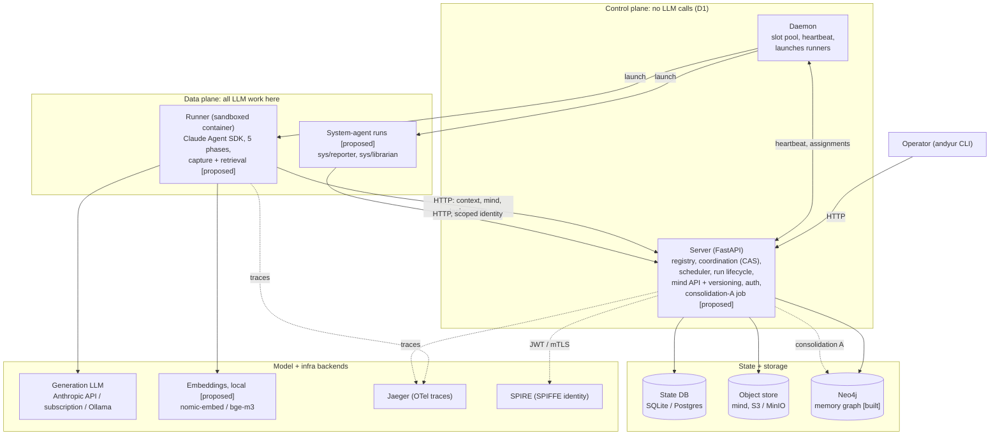

The spine: the operator and every run talk to the server over HTTP; the server
owns all state; the daemon is a dumb launcher; runs are where intelligence and
model calls live. Everything proposed (graph, embeddings, consolidation, system
agents) attaches at the edges without changing that spine.

### 2.1 Scaling topology [built]

The single spine above scales horizontally with no redesign, because the compute
tier (daemons, runners) is already multi-node and the control plane holds no
per-process state (D1, D16). Going multi-node is three swaps: the state store
(SQLite → Postgres, D17), a replication-safe scheduler (D18), and the shared mind
in object storage (D19). Servers then become stateless replicas behind a load
balancer, so any replica serves any request.

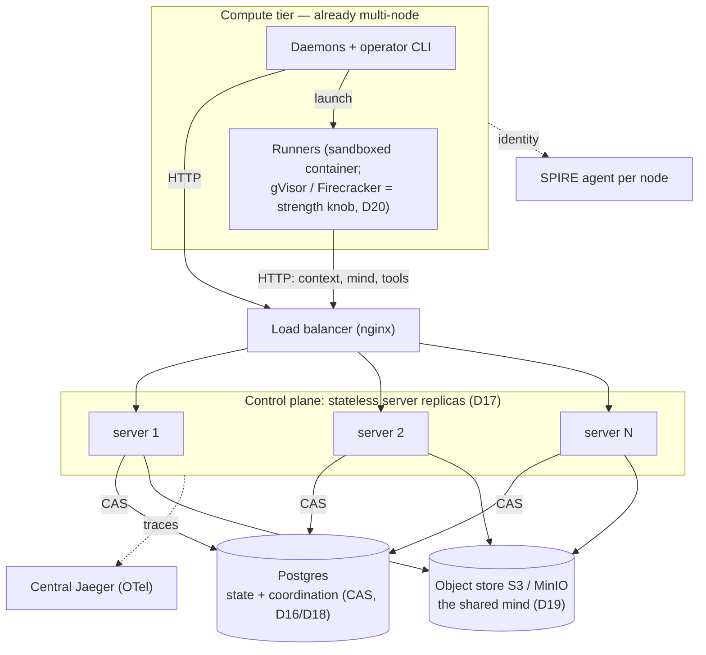

Verified locally (`infra/docker-compose.yml` `multinode` profile): two replicas
behind nginx over shared Postgres served a **single run's lifecycle across two
different replicas** (`start` on one, `finish` on the other) and a schedule fired
**exactly once** with both heartbeat loops running. Honest single-node
assumptions that remain: daemons/CLI **poll** (a very large fleet would move to
push), and each run spawns a subprocess, so the platform favors substantial runs
over high-frequency tiny ones. Full detail in `ARCHITECTURE.md` §16–17.

### 2.2 Identity: design vs built

Andyur's identity has a **built** layer and a **designed-but-not-built** layer.
Stating the line explicitly prevents conflating "we designed per-agent SVIDs"
with "Andyur issues them" (D21).

**Built today [built]:**

- **Process / runtime SVIDs, SPIRE-attested.** `control-plane`, `worker`,
  `runner`, `operator` each get a real SVID (attested by executable path + uid),
  used for mandatory **JWT-SVID auth** on every endpoint and optional **mTLS**
  (`ANDYUR_MTLS=on`). Verified end to end (`ARCHITECTURE.md` §12).
- **Per-agent identity as a platform-issued *name*.**
  `spiffe://andyur.local/agent/<name>` in `profile.json`, bound to run records,
  surfaced in the prompt. This is **not** an attested SVID: the runner binary is
  identical for every agent, so SPIRE cannot cryptographically distinguish agent
  A's runner from agent B's. The name rides on top of the runner's SVID.
- **Agent-scoped *authorization* via run tokens [built, R1].** With
  `ANDYUR_AGENT_AUTH=on` the control plane authorizes run-scoped calls on **which
  agent**, not just the SPIFFE role. A per-run, server-signed token
  `{agent, run_id, workflow_id}` is minted at assign, carried into the runner
  through the trusted spawn channel, and presented on every call: it confines a
  run to its own namespace (files, memory, graph), server-stamps
  `creator`/`sender`/`actor`, binds `handle`/`update` to ownership, and scopes
  run/workflow lifecycle. This is the agent-scoping the OAuth access token would
  provide, built as an **interim on the shared runner** (see
  `threat-model.md`, R1). The token is a readable-but-scoped bearer
  credential, and its confinement is only binding when the runner cannot mint a
  peer-role SVID -- i.e. it must be paired with per-container SPIRE isolation.

**Designed, not built [proposed]:** the *unforgeable* per-agent / per-run
**attested** SVID (R1 built the authorization model; what remains is the
credential's strength -- a credential the agent cannot read or trade for a
peer-role identity), via a launch-token flow:

- the **control plane acts as a SPIRE registrar**, creating a per-run entry for
  `agent/<name>` and minting a **one-time launch token**;
- the fired container **attests with that token** and gets its *own* SVID (not the
  shared `/runner` role);
- the runner then does an **RFC 8693 token exchange** at an OAuth authorization
  server for a scoped, user-delegated access token. The exchange delegates to
  another **agent**; the external tool or service is the token's **audience**. The
  granted authority is `entitlement AND pin AND ceiling AND audience`, with the
  ceiling read from the agent registry for BOTH the caller and the delegatee
  (`PUT /agents/{name}/ceiling`, operator-only).

**Two-service distinction** (keep it straight): the **SVID** comes from the
**identity authority (SPIRE)**; a **scoped access token** comes from an **OAuth
authorization server**. Andyur runs SPIRE. Andyur is **never** the authorization
server -- that is the adopter's, always (`docs/decisions.md` #1, closed).

**The bridge (what closes the gap), none built:**

1. control plane becomes a **SPIRE registrar** (per-run entry + launch token);
2. the sandbox **exposes identity** (mount the Workload API socket, or attest by
   per-run selectors the harness stamps) instead of being fully hermetic;
3. Andyur becomes a **client of the adopter's authorization server**, presenting
   the run's SVID as the RFC 8693 `actor_token`. It does not gain an AS of its
   own, and it does not sign access tokens.

So: **built = process SVID + agent name + agent-scoped authorization (run tokens,
R1); designed = the unforgeable attested per-run SVID.** R1 closed the
authorization model; the three bridge items above are what make the *credential*
unforgeable (and, per `ARCHITECTURE.md` §12, what make R1's confinement binding
rather than conditional).

---

## 3. Memory: representation vs lifecycle

The key reframe: **where knowledge lives** is a separate concern from **how
knowledge evolves over time**. Building the graph is representation. Keeping
memory coherent and useful (promoting, deduping, reconciling, compressing,
forgetting) is lifecycle, and it is the more fundamental of the two.

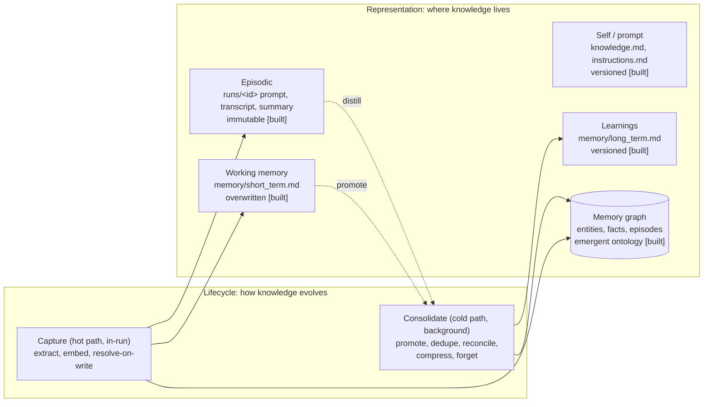

### 3.1 Representation: the tiers

| Tier | Files / store | Versioned | Analogy (human memory) |
|---|---|---|---|
| Self / prompt | `knowledge.md`, `instructions.md` | yes | learned skills / self-model |
| Learnings | `memory/long_term.md` | yes | semantic memory |
| Working memory | `memory/short_term.md` | no (overwritten) | working memory |
| Episodic | `runs/<id>/*` | no (immutable) | hippocampal episodes |
| Graph | Neo4j (proposed) | provenance-tracked | the associative index over semantic memory |

The graph is not a fifth file. It is a queryable, associative index *derived
from* the learnings and episodic tiers, with a **seeded-then-emergent** ontology
(D5): the agent starts with entity-type hints from its purpose, then discovers
the rest.

### 3.2 Lifecycle: capture vs consolidate

Two phases with different timing, mirroring how the brain records episodes while
awake and consolidates them during sleep.

- **Capture (hot path, inside a run).** Write what happened, extract entities,
  embed them locally, cheaply resolve obvious duplicates on write. Fast, online.
- **Consolidate (cold path, background).** The deliberate "sleep" phase. Five
  sub-problems:
  1. **Promotion / distillation:** short-term to long-term, what is worth keeping.
  2. **Deduplication:** collapse the same thing referred to many ways (entity resolution).
  3. **Conflict resolution:** new info contradicts old, decide which wins, mark the old superseded (temporal validity).
  4. **Compression / abstraction:** summarize many specifics into a general pattern.
  5. **Forgetting / pruning:** drop stale, low-value, low-confidence memory.

Consolidation never runs on the hot path. It is the A/B background work (D10,
D11), and it operates across *all* tiers, not just the graph.

---

## 4. The LLM-free control plane and system agents [proposed]

The invariant (D1): the control plane orchestrates intelligence, it does not
contain it. Platform-level intelligence (reporting, graph consolidation, fleet
analytics) is expressed as **system agents** that run through the normal runtime
with scoped SPIFFE identities. See `DESIGN.md` for the full
treatment. Consequence: consolidation A stays in the control plane only because
it makes **no** model call (pure math over precomputed vectors); anything needing
a model is a run.

---

## 5. Major flows (sequence diagrams)

### 5.1 Run lifecycle: trigger to completion [built]

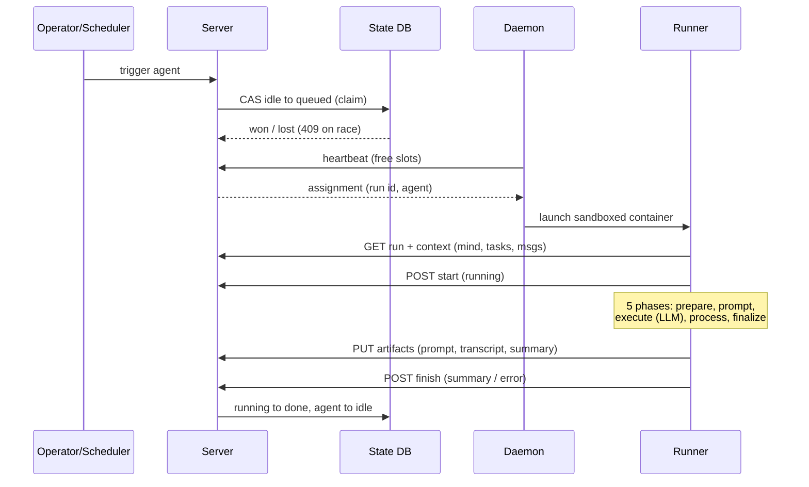

### 5.2 Memory capture, hot path [proposed]

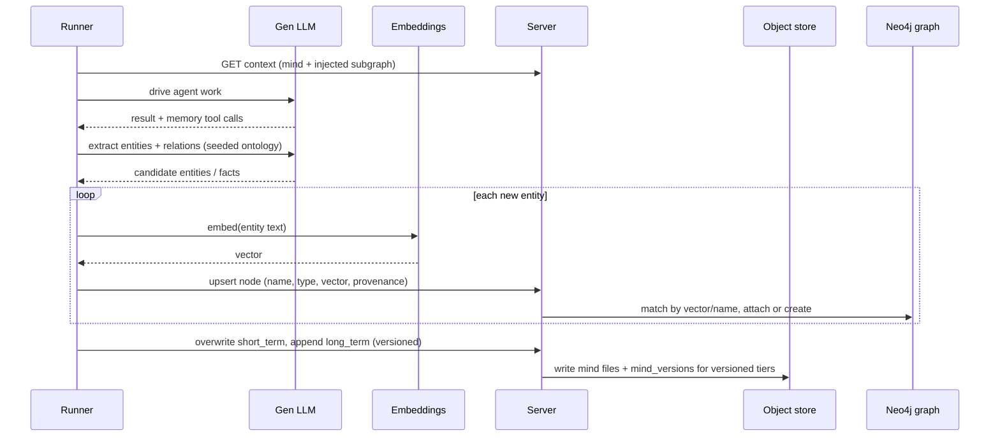

### 5.3 Retrieval and injection [proposed]

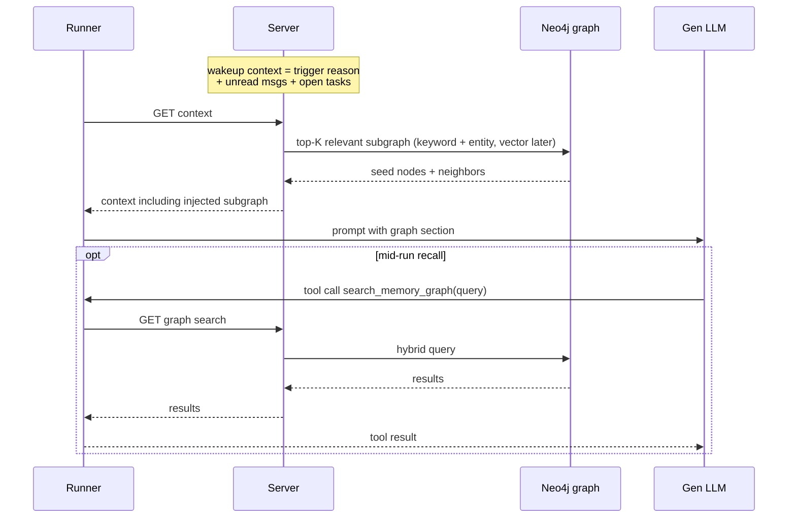

### 5.4 Consolidation A: mechanical, no LLM [proposed]

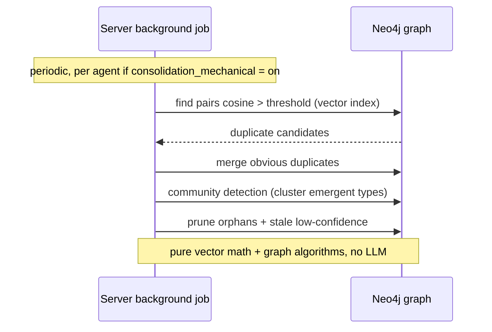

### 5.5 Consolidation B: sys/librarian [proposed]

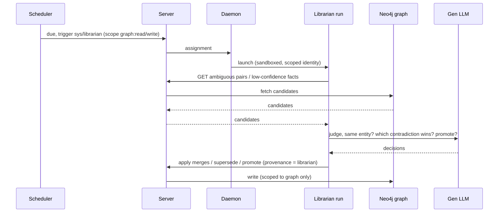

### 5.6 Reporting: sys/reporter [proposed]

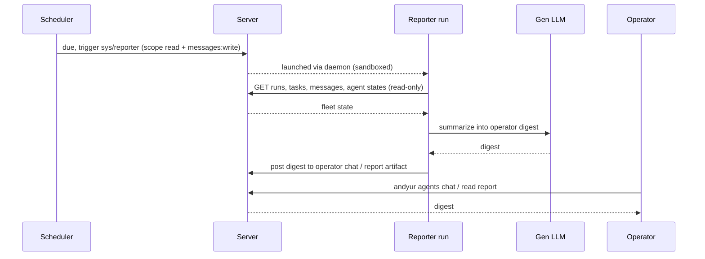

### 5.7 Mind versioning and restore [built]

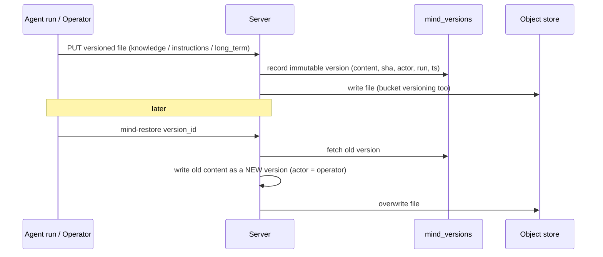

### 5.8 Multi-agent delegation [built]

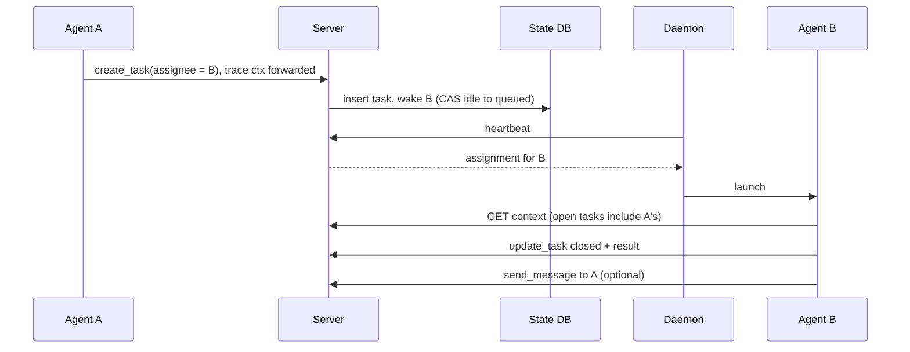

Other built flows (coordination CAS races, daemon self-healing, JWT + mTLS
handshake, cross-agent tracing, multi-node replica split) are described in prose
in `ARCHITECTURE.md` sections 5, 8, 11, 12, and 16.

---

## 6. Open items / next

- **Evaluate retrieval lift (D15):** A/B the graph-injected prompt vs flat
  `long_term.md`, reusing the evals harness, before committing to the graph's
  complexity.
- **Temporal validity depth:** start with `valid_from` / `superseded_by`; defer
  full bi-temporal facts.
- **Build vs adopt Graphiti (D6).** Graphiti (Zep's open-source
  `graphiti-core`) is the closest reference and validates our schema: episodes
  as ground-truth provenance, entities with evolving summaries, facts as
  temporal-triplet edges, bi-temporal validity (when true vs when learned), and
  hybrid retrieval (semantic + BM25 + traversal, no LLM at query time). It runs
  on Neo4j and supports local models (Ollama, `nomic-embed-text`).
  - **Why not adopt wholesale:** it fuses "make the LLM call" and "write the
    graph" in one process, which collides with three Andyur invariants. Its
    ingestion calls an LLM (would break the LLM-free control plane D1 if run in
    the server) *and* writes Neo4j directly (would force a sandboxed runner to
    hold Neo4j creds + network, undoing the mount-free, server-owns-storage
    property D2). It is also a heavy dependency (against self-contained /
    open-sourceable D6), needs reliable structured-output models (weak local
    models fail ingestion), costs multiple LLM calls per episode, and its
    incremental LLM resolution degrades as the graph grows (per the ATOM paper).
  - **Decision:** borrow the model, build thin. Ingestion runs in the **runner**
    (produces structured entity/relation JSON), and the graph **write routes
    through the server API** so the server stays the only thing touching Neo4j
    and the invariants hold. Do temporal/freshness conflict resolution
    deterministically in consolidation A rather than asking the LLM.
  - **Escape hatch:** if we later want Graphiti's maturity, wrap it as a
    dedicated **graph service** (a sibling process that owns Neo4j and runs
    Graphiti) which the runner and `sys/librarian` call over HTTP, re-imposing
    our server-owns-storage boundary around it. Keep the graph behind an
    interface from day one so this swap stays cheap.
- **Scope model:** implement role + scopes in `auth.py` for system agents before
  `sys/librarian` gets graph-write access.
- **Reuse map: LangMem for compaction + self-reflection (PSC).** The *mechanism*
  for memory consolidation (D10/D11) and the self-editing "PSC" loop (Phase 7) is
  off-the-shelf in **LangGraph + LangMem**, so the honest build is reuse-the-engine,
  build-the-governance:
  - **Consolidation / compaction** ← LangMem **Memory Managers** (extract, update,
    remove-outdated, consolidate/generalize) + **LangGraph Store** (long-term,
    namespaced, semantic search). Maps to consolidation B (LLM) and, via the
    Store's vector ops, the no-LLM parts of consolidation A.
  - **PSC / self-editing agent** ← LangMem **procedural memory + prompt optimizers**
    (`metaprompt` / `gradient` / `prompt_memory`) that propose updates to the
    agent's own instructions from handled feedback. This *is* the Phase-7 loop.
  - **Build only the Andyur governance:** the trigger policy (every N runs / 24h),
    the versioned mind (knowledge/instructions as artifacts with history + restore),
    the **80% shrinkage guard + validation**, multi-agent scoping/audit, and the
    **LLM-free control-plane invariant** (LangMem's managers/optimizers call an LLM,
    so they must run in the **data plane** as a `sys/librarian`-style run, not in
    the coordinator).
