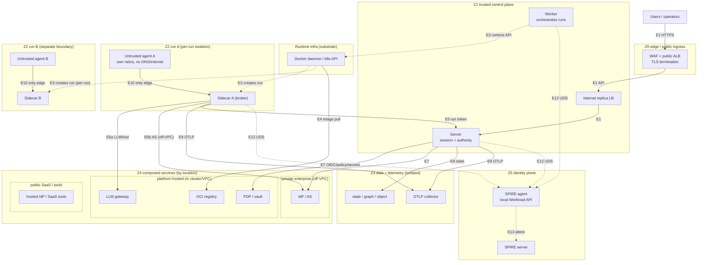
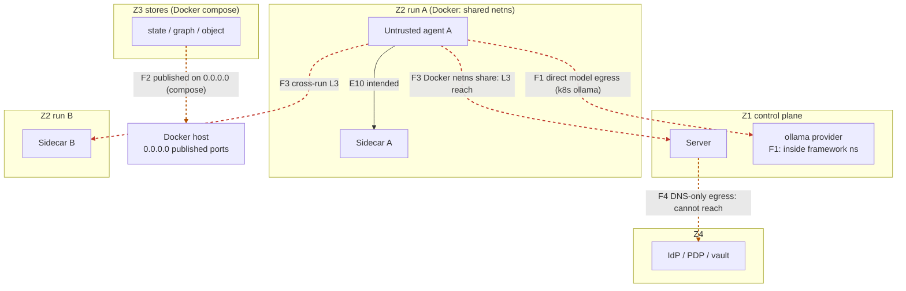

# Network topology and component trust zones

**Status:** Reference. Describes the target zone model, how much of it each
deployment mode enforces today, and the planned AWS target. Where a property is
enforced in Kubernetes but not in Docker, or decided but not built, this document
says so inline rather than implying parity.

External review (2026-08-15) returned "changes required," endorsing the trust
model and the O1 decision but flagging that a single blended diagram plus a
from/to grid could be mis-translated into over-permissive policy. This revision
addresses that: the authoritative artifact is now the **edge table**, which
states, per edge, the INITIATOR, protocol, enforcement point, and current status
separately; the zone diagram is illustrative; a **current-state** view marks the
deviations (F1-F4) as distinct edges; and Z0 ingress is separated from egress,
Z4 is split by network location, SPIRE is drawn as edges, and run creation,
registry pulls, telemetry, DNS, and the OIDC callback are all shown with their
real initiators. See "Review response" at the end for the finding-by-finding
disposition. Companion to
`adr-003-egress-topology.md` (the two egress paths),
`adr-005-openbao-credential-custody.md` (secret custody),
`authority-architecture.md` (the authorization-server broker),
`adr-008-byoa-agent-runtime.md` (the framework-neutral agent contract),
`authority-architecture.md` (who acts for whom), and
`replaceable-components.md` (what an adopter swaps).

This document answers three questions:

1. What network zones exist, and what is each allowed to reach.
2. Which runtime component belongs in which zone, and whether it is placed
   correctly today.
3. How that maps onto a cloud VPC (the future Terraform target).

Every claim is anchored to the source that enforces it. Where the code and this
document disagree, the code wins and this document is the bug.

## The trust zones

Andyur's network is six zones plus a runtime-infrastructure plane. The
boundaries are trust boundaries first and network segments second. The two
diagrams below are illustrative and derived from the edge table; the
authoritative statement of who may connect to whom is the edge table further
down, which separates initiator, enforcement, and status. In both diagrams a
solid arrow is a data-plane connection, a dashed arrow is identity/control
lifecycle, arrows point in the direction of connection INITIATION, and each edge
is labelled `Ex` to match the edge table.

### Target topology

Diagram scope (so "every edge maps to Ex" is honest): solid arrows are
data-plane edges, dashed arrows are identity/control lifecycle (E3 run creation,
E12 issuance). Per-run edges (E5, E6, E9, E12) are drawn once for Run A to stay
legible and repeat identically for Run B. E2 (operator-browser OIDC loopback
callback) and E14 (Z1 off-VPC egress path) are in the edge table but not drawn
here. The agent nodes have exactly one out-edge each (E10, to their own
sidecar); everything else from the agent is denied (E11): no edge to Z1, Z3, Z4,
Z5, the runtime substrate, the internet, or the other run. Run A and Run B are
separate boundaries; the sidecars share the framework egress plane (trusted),
the agents share nothing.

- **Z0 Edge / public (ingress).** The only public face, and ingress only: a WAF
  plus public ALB terminating TLS and admitting authenticated API traffic to the
  server. Outbound is a SEPARATE concern: Z1's reach to off-site externals runs
  over a controlled egress path (a NAT gateway, PrivateLink, or an egress
  proxy), enforced by that gateway's policy, not by placing egress "in Z0." The
  agent zone has no egress path through Z0 or anywhere else.
- **Z1 Control plane (framework).** Andyur's own code: the server, the
  worker/daemon, the operator shell, and the INTERNAL replica load balancer
  (nginx in front of server replicas, `infra/nginx.conf`). Note the shipped LB
  is internal, not a public edge; a public WAF/ALB is a Z0 element the deployment
  adds. The worker does not connect to runs; it creates them by calling the
  runtime API (see runtime infrastructure).
- **Runtime infrastructure (cross-cutting).** The container runtime the worker
  drives to create runs: the Docker daemon (`docker.sock`) or the Kubernetes API
  (`andyur/daemon/kubernetes_api.py`). Image pulls are performed here by the node
  / kubelet / container runtime (or CI/CD), not by application code. It is not an
  Andyur component; it is the substrate, called by the worker.
- **Z2 Agent-run zone.** One untrusted agent per run, plus its per-run
  sidecar/proxy. The sidecar is framework-trust code that lives inside the run
  zone so it can broker everything the agent is allowed to do. The agent is
  untrusted and treated as if already compromised. It is not Claude-specific: the
  same untrusted-agent / trusted-sidecar split is the framework-neutral contract
  in `adr-008-byoa-agent-runtime.md`, and Invariant 1 is what makes bringing your
  own agent safe.
- **Z3 Data and telemetry.** Andyur's state stores and the telemetry sink: the
  state database, the memory graph, the object store for agent minds, and the
  OTLP collector. Isolated, no internet. Reached by the server and the sidecar
  (state and OTLP); the agent has NO path to Z3, and any agent telemetry rides
  the sidecar.
- **Z4 Composed services (split by network location).** The components an adopter
  brings and swaps. "Composed / replaceable" is a component ATTRIBUTE, not a
  network zone, so the review is right that Z4 must be split by where each
  actually sits:
  - *Platform-hosted* (in the cluster/VPC, self-hosted): PDP, secrets vault, LLM
    gateway, OCI registry.
  - *Private enterprise* (off-VPC, reached over PrivateLink or a private link):
    the enterprise IdP and authorization server.
  - *Public SaaS* (off-VPC over the internet via the egress path): a hosted IdP.
  - *External tools* (per-manifest destinations the sidecar reaches).
  Reached by Z1 (IdP, PDP, vault) and by the sidecar (LLM gateway, AS, tools);
  the OCI registry is reached by the runtime/node, not application code; never by
  the agent.
- **Z5 Identity plane.** SPIRE issues short-lived SVIDs. Each workload reaches
  its LOCAL SPIRE agent over a Unix socket (Workload API); the SPIRE agent
  reaches the SPIRE server. SVID recipients are the server, the worker, and the
  per-run sidecar. The agent is excluded by construction, stated as a testable
  property: a validated manifest gives the agent neither Workload API / CSI
  access (`orchestrator.py:350` mounts the socket for the sidecar only, the agent
  gets no mount) nor an authorized SPIFFE selector, so no attestation the agent
  can perform yields an SVID.

## The two invariants

Everything below reduces to two rules. If a change would break either, it is
wrong regardless of how convenient it is. Both are stated as the target; the
enforcement subsections say exactly how much of each mode delivers today.

**Invariant 1: the agent is a sink.** An agent's only intended outbound edge is
to its own sidecar. It should have no DNS, no internet, and no route to the
control plane, the data zone, or any external component. Whatever the agent
legitimately needs, a model call or a tool call, the sidecar brokers.

Enforced:
- Kubernetes (network layer, fully): the trusted proxy and untrusted agent are
  separate pods precisely because NetworkPolicy is pod-scoped
  (`andyur/daemon/kubernetes_manifests.py:1-10`). The agent pod sits in the
  `andyur-runs` namespace under a default-deny
  (`infra/kubernetes/control-plane.yaml:306-313`); its generated egress policy
  allows only its own proxy pod, with no DNS
  (`andyur/daemon/kubernetes_manifests.py:456-466`). Open deviation: the shipped
  ollama config adds a second agent egress peer (see F1).
- Docker (app layer, not network layer): the agent joins the sidecar's network
  namespace (`andyur/daemon/orchestrator.py:384`), and the sidecar is on
  `andyur-runs` (`orchestrator.py:210-211`), where the server and worker also
  live (`infra/docker-compose.yml:45-46,76-77`). So at L3 the agent shares the
  sidecar's route to the control plane; `--internal`
  (`infra/docker-stack.sh:35-42`) removes only the internet gateway, not
  intra-network reachability, and the shared namespace gives the agent Docker's
  embedded resolver. The control-plane boundary in Docker is therefore held at
  the app layer, not the network layer (see F3), by three facts, all verified:
  the agent holds only the per-run channel token, never the run token
  (`orchestrator.py` agent argv carries only the channel token); the sidecar
  strips inbound credentials and identity headers
  (`andyur/proxy/sidecar.py:42-65`); and the sidecar listener serves only
  `/tools/<name>` and `/llm`, rebuilt from the manifest, so the agent cannot
  proxy an arbitrary URL through it (`andyur/proxy/app.py`,
  `andyur/proxy/sidecar.py:68-97`).

**Invariant 2: external components are reached by the control plane and the
sidecar, never by the agent.** The identity provider, policy decision point,
secrets vault, and data stores are Z1's dependencies. The enterprise
authorization server and the LLM gateway are the sidecar's. The agent reaches
none of them directly.

Enforced:
- The user's OIDC token is validated only within the control-plane server
  (`andyur/server/oidc.py` `validate_user_claims`, called only from
  `andyur/server/app.py`; no proxy, daemon, or agent code imports it).
- ADR-003 makes the per-run sidecar the sole egress for both tool and model
  traffic (`docs/adr-003-egress-topology.md:9-23,45,62`, verification bar item
  2). Destroying the sidecar structurally removes both paths.

## Edge table (authoritative)

Every cross-zone edge, by the party that INITIATES the connection. This table,
not the diagram, is the source of truth for writing NetworkPolicy, security
groups, or firewall rules. External components never initiate into Andyur (the
one exception is edge E2). Any pair not listed is denied.

Two independent axes, so a reader never confuses "authenticated" with "network
isolated." **Status** is whether the control is active in the shipped config:
**enforced** (active as shipped), **conditional** (active only when the relevant
peer/rule is configured), **planned** (the shipped manifests do not yet carry
it), **deviation** (current state departs from the target, see Findings).
**Layer** is WHERE the control lives: `network` (NetworkPolicy / internal
network / no route), `app` (application auth or logic), `rbac` (k8s RBAC /
socket perms), `mount` (presence/absence of a mounted socket or CSI volume),
`attestation` (SPIRE node/workload attestation), `gateway` (NAT / PrivateLink /
egress proxy). Where a boundary is network-layer in Kubernetes but only
application-layer in Docker, both are shown.

| # | Initiator | Target | Protocol | Enforcement point | Layer | Status |
|---|-----------|--------|----------|-------------------|-------|:------:|
| E1 | Operator / user (Z0) | Server (Z1) | HTTPS API | WAF/ALB + `auth.require` (JWT-SVID and, with user-auth, OIDC token) | app (+ edge WAF) | enforced |
| E2 | Operator BROWSER (Z0) | Console loopback callback | HTTP loopback | RFC 8252 `state` + PKCE; loopback bind only | app | enforced (local) |
| E2b | Operator BROWSER (Z0) | Console BFF `/session`, `/api/*` (loopback) | HTTP loopback | single-use launch token exchanged once for a session-secret header; Origin + Host fences; named route allowlist; body caps and deadlines; every refusal named and traced (`andyur/console/server.py`) | app | enforced (local) |
| E3 | Worker (Z1) | Runtime infra (Docker daemon / k8s API) | `docker.sock` / k8s API (TLS) | socket perms / k8s RBAC | rbac | enforced |
| E4 | Node / kubelet / runtime | OCI registry (Z4) | registry pull (HTTPS) | image-pull creds / imagePullSecrets | app | enforced |
| E5 | Sidecar (Z2) | Server (Z1) | HTTPS + run token | `auth.require(run)`; run-token bound to run SVID | app | enforced |
| E6a | Sidecar (Z2) | Z4 in-cluster peer (LLM gateway, in-cluster tool) | HTTPS (mTLS/DPoP) | NetworkPolicy proxy-egress peer + manifest binding + credential scoping | network (k8s) / app (Docker) | enforced (k8s) / deviation (Docker, F3) |
| E6b | Sidecar (Z2) | Z4 private/off-VPC (enterprise AS/tool) | HTTPS (mTLS/DPoP) | egress path (NAT/PrivateLink) + manifest binding + credential scoping | gateway + app | conditional (deployment egress path) |
| E6c | Sidecar (Z2) | Z4 public/SaaS tool (arbitrary FQDN) | HTTPS | manifest binding + credential scoping; **FQDN egress needs an egress proxy or FQDN-aware policy — stock k8s NetworkPolicy cannot do general FQDN filtering** | app (+ egress proxy) | planned (FQDN enforcement) |
| E7 | Server (Z1) | Z4 IdP / PDP / vault | HTTPS | server egress policy + endpoint auth | network + app | planned (rules not in shipped k8s, F4) |
| E8 | Server (Z1) | Z3 state stores | DB / bolt / S3 | server egress + store auth | network + app | conditional (only when external stores configured; shipped k8s uses a local store, F4) |
| E9 | Server (Z1) and Sidecar (Z2) | Z3 OTLP collector | OTLP | egress policy; **agent→Z3 denied** | network | conditional (collector peer configured); agent→Z3 denied is enforced |
| E10 | **Agent (Z2)** | its own Sidecar (Z2) | HTTP (channel / tool / model) + channel token | **the ONLY agent edge**: per-run internal network + channel token | network (k8s + Docker pod, O1) / app (Docker single-container) | enforced (k8s + Docker pod); app-layer in the single-container shapes |
| E11 | Agent (Z2) | anything else (Z1, Z3, Z4, Z5, other runs, internet) | any | NetworkPolicy default-deny (k8s); per-run internal network, agent single-homed (Docker pod, O1); app-layer only in single-container shapes | network (k8s + Docker pod) / app (Docker single-container) | enforced (k8s + Docker pod); app-layer in the single-container shapes |
| E12 | Workload (server, worker, sidecar) | local SPIRE agent (Z5) | UDS Workload API | socket mount present; **agent has no mount** | mount | enforced |
| E13 | SPIRE agent | SPIRE server (Z5) | gRPC | node attestation | attestation | enforced |
| E14 | Z1 (server) | off-VPC Z4 | HTTPS | controlled egress path: NAT / PrivateLink / egress gateway policy | gateway | planned (deployment-specific) |

Notes on initiation (correcting the earlier grid): run creation is E3 (worker to
the runtime API), NOT the control plane connecting to the sidecar; the sidecar
then initiates E5 to the server. Registry pulls are E4 (node/runtime), not
application code. The agent has exactly two rows, E10 (allowed, to its sidecar
only) and E11 (everything else, denied). "External systems never initiate" is
qualified by E2: the operator's browser initiates the loopback OIDC callback;
Andyur exposes no inbound webhooks.

## Diagram and edge conventions

For any drawn topology (this doc and derived diagrams):

1. Label every cross-zone edge with its INITIATOR and protocol (HTTPS, UDS/CSI,
   k8s API, Docker API, OTLP, DB protocol, registry pull).
2. Solid arrows are data-plane connections; dashed arrows are identity/control
   lifecycle (SPIRE issuance, run creation); red dashed arrows appear ONLY in the
   current-state deviation view.
3. Annotate each edge with its Status (enforced / conditional / planned /
   deviation) and its Layer (network / app / rbac / mount / attestation /
   gateway) from the edge table; never let "enforced" alone imply network
   isolation.
4. Show Run A and Run B as separate per-run boundaries; agent cross-run
   reachability is denied (E11) and must be drawn as denied, not omitted.
5. Ingress (E1/E2) and egress (E7/E14) are separate edges with separate
   enforcement points; never a single bidirectional "Z0" blob.

## Current state and deviations

The edge table above is the TARGET. The shipped code deviates at these edges;
each is a Finding below. In the current-state diagram they are the red edges
(deviations); the black edge is the intended E10 for contrast.

| Edge | Deviation today | Finding |
|------|-----------------|---------|
| Agent → LLM provider | In k8s ollama mode the agent has a direct egress peer to the model provider, and the provider sits in the framework namespace | F1 |
| E10 (agent → sidecar) in Docker | Agent shares the sidecar netns on `andyur-runs`, so it also has L3 reach to Z1 and other runs; the sink is app-layer only. Remediation is O1 (see "F3 remediation") | F3 |
| E7 / E8 (server → Z4 / Z3) in k8s | The shipped server manifest has DNS-only egress and a local store, so these edges are not yet permitted; a multi-node deploy must add the rules | F4 |
| Data-tier placement (Docker compose) | Compose publishes Z3/Z4 stores on the default bridge / `0.0.0.0` instead of an isolated network | F2 |

In the current-state diagram the red dashed edges (F1, F3) are reachability that
should not exist; the amber dashed edges (F4, F2) are, respectively, a required
edge the shipped manifest does not yet permit and a host-exposure the compose
default-bridge publishing creates. All are deviations from the target edge table.

Edge-to-gate mapping (each critical edge should map to a live gate whose mutation
turns it red): E1/E5 auth are covered by the existing auth and run-token suites;
E10/E11 agent isolation is gated in Kubernetes today and is the property the O1
gate adds for Docker; E6a sidecar egress scoping is covered by the ADR-003 SRE
gate. E7/E8/E14 (server egress) have no gate yet because the rules are not built
(F4). Building the missing gates is tracked with the corresponding Findings.

## Component classification

Tier legend: **F** framework (Z1, or Z2 sidecar), **A** agent (Z2), **X**
external/composed (Z4), **D** data (Z3), **I** identity plane (Z5). "Placement"
is whether the component is in the right zone; "Status" flags where the component
or its composition is planned or not-built rather than deployed-and-proven.

| Component | Tier | Placement | Status |
|---|---|---|---|
| server | F | OK | deployed |
| worker / daemon | F | OK | deployed |
| operator / CLI | F | OK | deployed |
| per-run sidecar / proxy | F (in Z2) | OK | deployed |
| agent run container / pod | A | OK (sink; F3 Docker caveat) | deployed |
| SPIRE server + agent | I | OK | deployed |
| internal replica LB (nginx) | F (Z1) | OK (internal, fronts server replicas; a PUBLIC WAF/ALB is a separate Z0 element) | multinode profile |
| state DB (Postgres) | D | OK in k8s target; compose parity (F2) | deployed |
| object store (MinIO/S3) | D | OK in k8s target; compose parity (F2) | deployed |
| graph DB (Neo4j) | D | OK in k8s target; compose parity (F2) | deployed |
| tracing (Jaeger) | D | OK | deployed |
| OIDC IdP (Keycloak) | X | OK (server-reached, `config.py:355-357`) | test harness; reference deployment planned |
| enterprise AS | X | OK (sidecar-reached, `config.py:418`) | **decided, NOT built end-to-end** (adr-006; `authority-architecture.md` STATUS; `../ROADMAP.md` gap 8). A reference-AS exchange leg is demonstrated (`./run.sh actor-leg-verify`) |
| PDP / AuthZEN (OPA) | X | OK (server-reached, `config.py:397-398`) | opt-in |
| secrets vault (OpenBao) | X | OK (adr-005) | opt-in |
| OCI registry | X | OK (pulled by the node/kubelet/runtime, or CI/CD, not by application code) | deployed |
| LLM gateway (LiteLLM) | X | OK (sidecar-reached, ADR-003) | deployed; compose reachability (F2) |
| **LLM provider (ollama)** | **X** | **MISPLACED (F1)** | dev stand-in |

## Findings

### F1 (open): the LLM provider is in the wrong zone

A model provider is a Z4 external component reached by the sidecar, which is the
model path ADR-003 defines. Today the ollama provider is misplaced in two ways
in Kubernetes:

- It runs as a Deployment and Service inside the framework namespace
  `andyur-system` (`infra/kubernetes/control-plane.yaml:66-108`), so a Z4
  component is baked into Z1. It is in fact a socat bridge to a model server on a
  host address (`control-plane.yaml:96-99,330-332`), a development stand-in that
  became structural.
- In ollama mode the agent pod is given a direct egress peer to it
  (`control-plane.yaml:272-274`; the agent egress peer in
  `andyur/daemon/kubernetes_manifests.py:459-466`), and the ollama ingress admits
  any `component=agent` pod namespace-wide, not per-run
  (`control-plane.yaml:323-329`). That is an agent reaching a Z4 component
  directly, breaking Invariant 1, and it bypasses the sidecar, breaking ADR-003
  (model calls must traverse the sidecar). Because the peer is a host-bridge, it
  also weakens the "no route off the run zone" property for that one host:port.

Docker analog (dev-only): in ollama mode the agent is given the model URL
directly (`orchestrator.py`, the ollama-mode agent env), reaching the model
without the sidecar. It resolves only in dev via the host gateway; the brokered
prod path does not use it. Same class as the Kubernetes case, lower severity.

Correct target: the agent reaches the model only through the sidecar's model leg,
and the provider sits in Z4 behind the LLM gateway. The api-mode path already
does this. The fix is part of the agent-model-egress work and is not applied in
this document.

### F2 (open, lower severity): docker and kubernetes disagree on the data tier

In docker-compose the Z3/Z4 data-plane components ship in one file on the default
bridge network and are published on `0.0.0.0` (`infra/docker-compose.yml`, the
Postgres, MinIO, Neo4j, and Jaeger service blocks), while the framework services
bind loopback. Two consequences: a prod compose run cannot reach the LLM gateway
by name (it is on the default network, the run is on `andyur-runs`); and a dev
run, which receives a host gateway, has a route to those published ports. Prod
Kubernetes is not affected. Target: give the compose externals their own network
and loopback publishing, so compose models the tiering Kubernetes intends.

### F3 (open): in Docker the agent shares the sidecar's netns, so the network-layer sink is app-layer only

As detailed under Invariant 1, the Docker agent joins the sidecar's network
namespace (`orchestrator.py:384`) on `andyur-runs`, where the server and worker
also sit (`docker-compose.yml:45-46,76-77`). Docker bridge networks have no
intra-network segmentation, so the agent has an L3 route to the control plane and
to the embedded DNS resolver. This is the exact arrangement Kubernetes avoids by
using two pods (`kubernetes_manifests.py:1-4`). The boundary is not lost, but in
Docker it is enforced at the app layer only (no run token in the agent, inbound
credential stripping, and a sidecar that serves only `/tools/*` and `/llm`), not
at the network layer as in Kubernetes. Edges E10/E11 and Invariant 1 describe
the target; their enforcement layer is `network` and status `enforced` in
Kubernetes, but in Docker it is a `deviation` (layer `app` only), i.e. Docker
relies on the app-layer controls until O1 lands.
This is decided not acceptable; the remediation (option O1, two network
namespaces per run behind a per-run internal network) is analyzed and recommended
below in "F3 remediation."

### F4 (open): the shipped Kubernetes server has no data-plane egress

The shipped server manifest runs a local store (`ANDYUR_DATA_DIR=/var/lib/andyur`
on a PVC, `control-plane.yaml:204,226-227`, no `ANDYUR_DB_URL`/`_S3_ENDPOINT`/
`_NEO4J_URL`) and its NetworkPolicy egress is DNS-only
(`control-plane.yaml:374-393`). So the "Z1 reaches Z3/Z4" edges are not backed by
the shipped manifest: a real multi-node deployment must add server egress rules
for its external DB, IdP, PDP, and vault, the way the worker policy already adds
an explicit rule for the Kubernetes API (`control-plane.yaml:361-372`). Until
then the shipped manifest is single-node/local by default.

## Threat model note: a compromised sidecar

The agent is modeled as already compromised. The sidecar is framework-trust and
lives in Z2, and it holds more than the agent: the user's subject token, the
run's JWT-SVID and X509-SVID material (`andyur/proxy/sidecar.py:100-151`), the
run token, and the LLM gateway key (`kubernetes_manifests.py:224-226`), plus
egress to the control plane, the AS, the LLM gateway, and tools. A sidecar
compromise is therefore a Z1+Z4 blast radius, larger than the agent it brokers
for. What bounds it: SVIDs are short-lived and per-run, credentials are scoped to
the one run, and the sidecar is destroyed with the run. The sidecar is trusted
because it is small, Andyur-authored, and enforces Andyur facts; it is not a
zero-trust component, and hardening it (and the option to compose it, adr-004) is
a standing concern, not a solved one.

One concrete instance of this residual, introduced by O1: to serve the agent on
the per-run network the sidecar binds its channel, tool service, and model proxy
on all interfaces, which also exposes them on the shared framework network
(SANDBOX_NETWORK / andyur-runs) where the framework and sibling sidecars live.
The untrusted agent cannot reach that interface (it is single-homed on the
per-run internal network, E11), so this is not an agent escape. The channel and
tool service are token-gated -- with one caveat: under the non-default
`ANDYUR_AGENT_SPLIT_TOKENS=off` the daemon mints no channel token, so the CHANNEL
loses its gate (the tool service keeps its own, minted inside the sidecar). The
model proxy is deliberately unauthenticated (it strips the caller's credential
and injects the broker credential, relying on the boundary). So a COMPROMISED
sibling sidecar on the framework network could drive another run's model proxy as
an inference relay on that run's broker token (and, with split-tokens off, its
channel). All of it is bounded by the per-run token scope and SVID TTL, reachable
only by a trusted sibling sidecar and never by the agent; closing it fully
(per-run-interface binding, authenticating the model proxy, or forcing tokens on
in pod mode) is a tracked hardening follow-up, not part of the O1 property.

Scale ceiling (operators): one `--internal` network per headless pod run draws a
subnet from Docker's default address pool (~28-31 usable /24s on a default
daemon, shared across all workers on the host and minus the stack's own
networks). So concurrent headless pod runs per host are capped there regardless
of `ANDYUR_WORKER_SLOTS`. Exhaustion fails CLOSED (`_net_create` returns False,
the launch aborts and surfaces docker's pool error), it does not weaken
isolation. Raise the ceiling with Docker's `default-address-pools` daemon config;
size `ANDYUR_WORKER_SLOTS` (times workers-per-host) under the pool.

## F3 remediation: run-scoped network isolation (options and recommendation)

**Status: ACCEPTED and BUILT (O1), 2026-08-15.** The external re-review endorsed
O1; it is now implemented for Docker pod mode (per-run internal network, agent
single-homed; `andyur/daemon/orchestrator.py`, `andyur/runner/runner.py`) and
live-gated by `./run.sh run-isolation` (agent reaches only its sidecar; server,
cross-run, internet, and external DNS all refused; with an inline F3 mutation
proving the negatives). The single-container shapes (`off`/`process`) remain
uid-boundary only, as noted below. Original decision input (operator,
2026-08-15): the current Docker posture is not acceptable. An untrusted agent
must not share a network with the control plane or with other runs. The agent's
network and namespace must be run-specific. O5 (accept the status quo) is
therefore rejected; O1 is the recommended remediation but is not yet ratified.
Once accepted this should carry an explicit `Status: Accepted <date>` and may
graduate to its own ADR (`adr-009-run-scoped-network-isolation`), matching the
repo's ADR shape for decisions with alternatives.

The governing constraint: **a network namespace is the unit of reachability.**
Every process or container that shares a namespace can reach exactly what that
namespace can reach. The sidecar must reach the control plane (run token), the
authorization server, and the LLM gateway. Therefore, to give the sidecar that
egress while denying it to the agent, the agent must be in a DIFFERENT network
namespace from the sidecar. This is the same reason Kubernetes uses two pods
(`andyur/daemon/kubernetes_manifests.py:1-4`), and Kubernetes already isolates
this way; the work is to bring Docker to parity.

On "why not one pod": this does not add containers. In pod mode Andyur already
runs two containers per run, a run/sidecar container and an agent container
(`orchestrator.py` `run_container` / `agent_container`); today they share a
netns (`orchestrator.py:384`, `--network container:`). The fix keeps the same two
containers and stops them sharing a netns. In the single-container shapes
(`ANDYUR_AGENT_SPLIT=off` or `process`) the agent is a uid inside the sidecar
container, so it shares the netns by construction and network-layer isolation is
not achievable there; those shapes rely on the uid boundary. Network-layer agent
isolation requires the two-container (pod) shape.

### Options considered

| # | Option | Closes agent→control-plane (a) | Closes cross-run (b) | Docker/k8s parity | New dependency | Verdict |
|---|--------|:---:|:---:|:---:|:---:|---|
| O1 | **Two network namespaces per run + per-run internal network** (the k8s two-pod model, ported to Docker) | yes | yes | yes (same model both modes) | none | **RECOMMENDED** |
| O2 | One shared netns + a per-run network | no | no | no | none | insufficient |
| O3 | One shared netns + iptables `--uid-owner` egress firewall | yes (fragile) | yes (fragile) | no (k8s cannot uid-filter) | NET_ADMIN in the run | rejected |
| O4 | microVM (Firecracker/Kata) or gVisor per run | yes | yes | via runtimeClass | new runtime | future defense-in-depth, not the F3 fix |
| O5 | Accept; scope Docker to single-tenant | no | no | n/a | none | rejected by operator |

**O1 — two netns per run + per-run internal network (recommended).** Each run
gets a dedicated `--internal` Docker network containing only its agent container
and its sidecar container. The agent has its own netns on that network only, with
no route to the control plane, other runs, or the internet; it reaches the
sidecar by name, authenticated by the per-run channel token that already exists.
The sidecar is attached to the per-run network (to serve the agent) and to a
framework egress network (to reach the control plane, AS, and LLM gateway).
Because the agent is not on the framework network, it inherits none of the
sidecar's egress. This is exactly what Kubernetes does with two pods and an
agent-egress-to-proxy-only NetworkPolicy, so both modes share one isolation model
and one set of gates.

Two residuals, both acceptable and worth stating so the table's "yes" is not
overread:
- Cross-run isolation is for the UNTRUSTED AGENT. The trusted sidecars still
  share the framework egress network and remain mutually reachable there, by
  design and exactly as in Kubernetes (framework/proxy components share a plane).
  The sidecars are the credential-holders the whole model already trusts.
- DNS becomes SCOPED, not absent. The agent keeps Docker's embedded resolver
  (127.0.0.11), but it is network-scoped: it resolves only members of the
  per-run internal network, which is just its own sidecar. It cannot resolve the
  framework network or other runs (verified Docker behavior, not a leak). This is
  a small, bounded delta from the Kubernetes "no DNS" property; if strict no-DNS
  parity is wanted, the agent can address the sidecar by pinned IP or alias
  instead.

Cost: larger than a single bind change. (1) The channel, tool service, and model
proxy bind `0.0.0.0` (up from `127.0.0.1`) and advertise the `sidecar` alias, so
the URL handed to the agent resolves from its own netns; the agent, single-homed
on the per-run net, is the only untrusted reader, and the SANDBOX_NETWORK
exposure the `0.0.0.0` bind also creates is the trusted-plane residual noted in
the threat model. (2) `ModelProxy` needs an
`advertise_host` seam like `ToolService` already has (`toolservice.py:131,142`);
today `ModelProxy.start()` returns `http://{self._host}:{port}`
(`modelproxy.py:170`) with no advertise, so binding to `0.0.0.0` would advertise
an unroutable address to the agent. (3) The agent's channel URL is hardcoded to
loopback (`orchestrator.py:425`, `--channel-url http://127.0.0.1:...`) and must
become the sidecar's per-run-network name. (4) The orchestrator creates and tears
down the per-run `--internal` network per run. No new runtime, no elevated
capability, only Docker primitives already in use. Low-risk because the
Kubernetes path already implements this exact addressing model (`runner.py`
binds ToolService to `0.0.0.0` with `advertise_host=pod_ip` and the controller
substitutes the proxy Pod IP into the agent's URL); O1 ports a code path the repo
already ships.

**O2 — one shared netns + per-run network (insufficient).** Give each run its own
network but keep the agent and sidecar sharing a netns. This removes the shared
`andyur-runs` bridge, but the shared netns still needs egress to the control
plane, so the agent still reaches it (finding a stands). And because the run unit
must sit on a network that reaches the server, either the server joins every
per-run network (unworkable) or the run attaches to a shared framework network,
which reintroduces cross-run reachability. A shared namespace cannot both reach
the server and isolate the agent. This is the core reason O1 is required.

**O3 — one shared netns + uid-owner egress firewall (rejected).** iptables can
match egress by the originating uid (`xt_owner` on the OUTPUT chain). The usual
setuid-to-bypass weakness is blocked here because the agent runs as a distinct
unprivileged uid with no effective `CAP_SETUID` and `no-new-privileges`, so it
cannot change uid to impersonate the allowed identity. Note this protection is
the missing capability plus `no-new-privileges`, NOT seccomp: the shared-netns
shape O3 governs is the single-container path, which runs the RUNNER seccomp
profile (`orchestrator.py:239`) and that profile PERMITS setuid because the
runner uses setpriv to drop the CLI; the setuid-denying AGENT profile applies
only to the two-container pod shape (`orchestrator.py:393`), which is not a shared
netns and would never use this option. O3 is still rejected: it needs
`NET_ADMIN` in the run to install rules, has a documented bad interaction between
`--uid-owner` OUTPUT rules and Docker's embedded DNS (127.0.0.11 queries are
DNAT'd and serviced outside the container's uid context), keeps the agent in the
sidecar's namespace so any misrule fails open, and has no Kubernetes equivalent
(NetworkPolicy cannot select by uid), so it would fork the isolation model
between the two deployment modes. Rejected in favor of the portable O1.

**O4 — microVM or gVisor per run (future defense-in-depth).** Running each agent
in a Firecracker/Kata microVM or under gVisor gives it its own kernel and network
stack, the strongest form of "run-specific everything," and is the emerging 2026
baseline for executing untrusted model-generated code. It is orthogonal to F3:
even inside a microVM the agent's egress would still be brokered by the sidecar
over a per-run tap, i.e. O1's model at the VM boundary. It is a larger change
with a new runtime dependency and belongs on the isolation roadmap as a layer
above O1 (kernel isolation on top of network isolation), not as the F3 fix.
Docker Enhanced Container Isolation (Sysbox) sits in the same bucket: it hardens
the user-namespace / privilege boundary, not network reachability, so it is
orthogonal defense-in-depth alongside O4 and not an F3 remedy either.

**Candidates dismissed briefly.** A NetworkPolicy-capable Docker CNI
(Calico/Cilium, or running under kind/k3d) would let Docker apply the literal
Kubernetes policy; O1 reaches the same reachability with native Docker networks
and no new dependency, which is why it wins on the "parity, no new dependency"
criterion. A transparent egress proxy the agent default-routes through is not a
separate option: it is O1's sidecar-on-two-networks, except the sidecar brokers
at the app layer (explicit `/tools/*` and `/llm` calls) rather than transparently
at L3, which is the stronger sink. macvlan (hands the agent a routable LAN
identity) and network aliases (naming only) are not isolation primitives and are
omitted deliberately.

**O5 — accept and scope to single-tenant (rejected by operator).** Documented for
completeness; the operator rejected leaving the agent with any network path to
the control plane.

### Recommendation

Adopt **O1**: two network namespaces per run behind a per-run internal network,
in the pod shape, matching what Kubernetes already enforces. It closes both the
agent-to-control-plane path and cross-run reachability at the network layer, uses
only existing Docker primitives, keeps one isolation model across Docker and
Kubernetes, and needs no new capability or runtime. Layer **O4** on later as
kernel-level defense-in-depth for untrusted agent code; it does not replace O1.

Verification when built: a live gate that starts a run and proves, from inside
the agent's namespace, that it can reach ONLY its sidecar, and that connections
to the control-plane server, the worker, a second concurrent run's sidecar, and
the internet all fail at the network layer, with a positive control that the
brokered tool and model calls still succeed through the sidecar. The gate also
asserts DNS scope: the agent resolves its sidecar's name but not the framework
network or another run. The property is mutation-tested (remove the per-run
network isolation, watch the negative go red). This is Docker's port of the
isolation Kubernetes already gates, and complements the ADR-003 verification bar.
When O1 lands, the enforcement-by-mode table below updates (the Docker rows for
"no route to control plane" and "no DNS" move from app-layer-only to enforced).

Implementation surface: `orchestrator.py` (per-run network create/teardown and
the agent's channel URL), the runner bind and advertise addresses
(`toolservice.py`, `modelproxy.py`, `agentchannel.py`), and the network
lifecycle. This is a design record; the implementation is deferred and tracked
separately.

## Enforcement by deployment mode

The two modes are not at parity. Kubernetes enforces the sink at the network
layer; Docker enforces the control-plane boundary at the app layer (F3).

| Boundary | Docker | Kubernetes |
|---|---|---|
| Agent has no internet | pod mode (O1): per-run `--internal` network -- no default route or masquerade, so no internet/off-subnet egress. NOTE an `--internal` net still HAS a gateway and it IS the Docker host (L3-reachable at the gateway IP); host services are kept off it by binding every compose publish to `127.0.0.1` (docker-compose.yml). single-container shapes: `andyur-runs` `--internal`, no host gateway in prod | namespace default-deny; per-run egress to proxy only |
| Agent has no route to the control plane | pod mode (O1): YES at network layer -- agent single-homed on its per-run network, no route to `andyur-runs`; single-container shapes: app-layer only (uid boundary) | yes, network layer (separate pods, egress to proxy only) |
| Agent has no DNS | pod mode (O1): scoped -- the per-run network's embedded resolver sees only the sidecar. REQUIRES Docker/Moby >= 26.0 (or 25.0.5): before that, CVE-2024-29018 lets the embedded resolver forward external lookups from an `--internal` net out through the host, a DNS-label exfil channel. The `run-isolation` gate's DNS check goes red on a vulnerable daemon. single-container shapes: shares the container resolver | yes (`kubernetes_manifests.py:456-459`) |
| Data / external off the agent path | external stores off `andyur-runs` (F2 caveat) | external endpoints not in manifests (F4) |
| Identity | SPIRE socket via mount, path/uid attestation; agent has no mounts | SPIFFE CSI, ClusterSPIFFEID |

## AWS VPC mapping (planned, not built)

The future Terraform target maps the zones onto the standard three-tier VPC.
Isolation is enforced by NetworkPolicy and security groups; a missing NAT route
only removes internet-bound egress and is not, on its own, east-west isolation.

- **Public subnets:** NAT gateways and an application load balancer. Operator and
  user ingress terminates here. A truly off-VPC identity provider (a SaaS IdP) is
  reached from here by NAT or PrivateLink; that is the only place the NAT route
  matters.
- **Private application subnets:** the cluster nodes that run both the framework
  pods (Z1) and the agent-run pods (Z2). Agent pods stay a sink through
  NetworkPolicy (default-deny plus egress-to-sidecar-only) and security groups.
  Removing the NAT route stops internet egress but does not, by itself, stop the
  agent from reaching in-VPC destinations, so the NetworkPolicy is load-bearing.
- **Isolated database subnets:** the state database and the identity provider's
  database, in subnets with no internet route and security groups admitting only
  their consumers (Z3, plus the IdP's own store).
- **External identity tier:** the reference identity provider in its own
  namespace or subnet, or an off-VPC enterprise IdP. The server reaches it; the
  agent does not, because the agent's NetworkPolicy has no egress to it.

**Hard prerequisite for EKS:** Invariant 1 depends on a CNI that ENFORCES
NetworkPolicy. The default AWS VPC CNI does not enforce NetworkPolicy unless the
network-policy add-on is enabled; otherwise use Calico or Cilium. On a cluster
whose CNI ignores NetworkPolicy, the agent-sink property fails open with no
error, and pods also get routable VPC IPs. The Terraform must make the enforcing
CNI a checked precondition, not an assumption.

Planned Terraform layout, one module per concern so each is independently
testable: `vpc`; the cluster; `databases` (the Andyur state store and the IdP's
store); `andyur-platform` (namespaces, identity plane, control plane, network
policies); `idp` (the reference identity provider and its database); and `data`
(object store, graph, tracing, whichever are self-hosted rather than managed).
The identity module is separate so an adopter drops it and points the platform at
their own IdP by wiring the OIDC endpoints only.

## The swap seam

An adopter replaces Z4 without touching Andyur code. The identity provider
(OIDC), policy decision point (AuthZEN), secrets vault (adr-005), LLM gateway
(ADR-003), and enterprise authorization server (adr-006) are all reached over
configured URLs on natural wire protocols. See `replaceable-components.md` for
the exact variables and the swap contract; note that document lists the
authorization server as decided-but-not-built today. The framework (Z1), the
agent sink (Z2), and the identity plane (Z5) are Andyur's and are not swap points.
The per-run sidecar is Andyur code today; composing or replacing it with an
Envoy-based data plane is under evaluation in adr-004 and not accepted.

## Review response (external review, 2026-08-15)

The review returned "changes required," endorsing the trust model and the O1
decision. Disposition of each finding:

- **1 (Z0 mixes ingress and egress):** fixed. Z0 is ingress only; egress is a
  separate concern over a controlled path (edges E7/E14), enforced by the
  gateway, not by Z0.
- **2 (run creation is not Z1→sidecar):** fixed. Run creation is edge E3 (worker
  to the runtime API); the sidecar separately initiates E5 to the server.
- **3 (SPIRE is a footnote):** fixed. SPIRE is now edges E12/E13 with the local
  Workload API, the SVID recipients, and the agent's exclusion (no socket/CSI)
  stated.
- **4 (target and current merged):** fixed. The edge table is the target;
  "Current state and deviations" lists the deviation edges (F1-F4) separately and
  the conventions reserve red dashed edges for the current-state view.
- **5 (sidecar egress blast radius):** addressed at E6, which names the three
  distinct controls (manifest binding, credential scoping, destination
  allowlist) rather than one "egress" edge; the compromised-sidecar threat note
  remains.
- **6 (Z4 is a category, not a zone):** fixed. Z4 is split by network location
  (platform-hosted / private enterprise / public SaaS / external tools), with
  composed/replaceable kept as a component attribute.
- **7 (public LB miscas Z1):** clarified. Andyur ships an INTERNAL replica LB
  (Z1); a public WAF/ALB is a Z0 element the deployment adds.
- **8 (telemetry omitted):** fixed. Edge E9 shows server and sidecar to the OTLP
  collector; the agent is denied Z3.
- **9 (registry pull actor):** fixed. Edge E4 attributes pulls to the
  node/kubelet/runtime (or CI/CD), and the component row says the same.
- **10 ("external never initiate" too broad):** qualified. Edge E2 is the
  operator browser's loopback OIDC callback; Andyur exposes no inbound webhooks.

The rendered target and current-state diagrams landed in f3141d0. The focused
re-review (2026-08-15) then endorsed the architecture and O1 and returned a
documentation-only "minimum acceptance patch," applied here: edge identifiers
and arrow styles corrected, the internal LB connected (ALB → LB → server), the
status taxonomy split into Status (enforced / conditional / planned / deviation)
plus a separate enforcement Layer so authenticated/RBAC/mount/attestation
controls are not miscounted as network isolation, E6 split by destination
(in-cluster / off-VPC / public-FQDN, noting stock NetworkPolicy cannot do FQDN),
F2 drawn in the current-state view, Z4 visually split by location, and the SPIRE
wording made testable. Remaining are implementation follow-ups, not doc items:
the planned server-egress
edges (E7/E8/E14).
